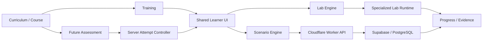

# AutoLearnPro / TorqueMind

AutoLearnPro is an evidence-aware automotive technology learning platform. TorqueMind is the diagnostic reasoning and simulation layer used across scenario training, interactive labs, curriculum delivery, and future assessment workflows.

The project is designed around a simple principle: **training, labs, and future assessments may share learner-facing components, but higher-stakes state and decisions must remain server authoritative and separately governed.**

## Live applications

- Public site: https://autolearnpro.com/
- Learner application: https://app.autolearnpro.com/
- Course / exam domain: https://exam.autolearnpro.com/

Production delivery uses Cloudflare Workers and static assets. Supabase provides authentication and PostgreSQL persistence.

## What the project includes

### Curriculum and learning paths

The repository contains structured undergraduate and graduate curriculum architecture, course metadata, lesson plans, competencies, academic pathway validation, and evidence-governance contracts.

### Diagnostic scenarios

Learners work through structured diagnostic scenarios that emphasize evidence collection, system isolation, measurement, comparison, correlation, verification, and documentation.

### Interactive labs

Current browser-based lab engines include:

- circuit lab
- sensor lab
- starting-system lab
- network lab
- relay / load lab
- multivoltage lab
- actuator lab

Labs keep their specialized simulation and engineering runtimes while sharing common learner, governance, audit, and completion concepts.

### Training questions

Training-question delivery is intentionally separated from assessment eligibility. Training content may provide immediate feedback and retry behavior when its approval contract allows it.

### Assessment architecture

The repository contains infrastructure for future server-authoritative assessment attempts. Assessment delivery remains fail-closed unless the required governance, eligibility, evidence, and runtime gates are satisfied.

Training approval does **not** automatically grant scored, institutional, high-stakes, or production-assessment eligibility.

See:

- `docs/architecture/shared-attempt-governance.md`
- `docs/SYSTEM-ARCHITECTURE.md`
- `dashboard/student/scenario/WORKFLOW.md`

## Architecture at a glance



## Repository layout

| Path | Purpose |
| --- | --- |
| `worker/` | Canonical Cloudflare Worker production API runtime |
| `dashboard/student/` | Learner dashboard, scenarios, and labs |
| `exam-site/` | Course and exam-domain static assets |
| `data/` | Curriculum, scenario, evidence, and governed content data |
| `supabase/` | PostgreSQL migrations, database contracts, and security tests |
| `engineering/` | Engineering models and generated artifacts |
| `scripts/` | Validation, build, sync, reporting, and deployment helpers |
| `tests/` | Jest and Playwright verification |
| `docs/` | Architecture, governance, deployment, and operational documentation |
| `api/` | Legacy API implementations retained during migration; not the canonical production security boundary |

## Local development

### Prerequisites

- Node.js 22.19.0 or newer (see `package.json` `engines`)
- npm
- Git

Install dependencies:

```bash
npm ci
```

Run the local static test server:

```bash
npm run start:test
```

Run the main test suite:

```bash
npm test
```

Run Playwright:

```bash
npm run test:playwright
```

Run both:

```bash
npm run test:all
```

Build the static deployment:

```bash
npm run build
```

## Important validation commands

```bash
npm run validate:scenarios
npm run validate:academic-pathways
npm run validate:program-architecture
npm run validate:curriculum-content
npm run validate:evidence-approval
npm run validate:circuits
npm run test:supabase-contracts
npm run docs:mermaid
```

The repository contains additional targeted validators for engineering artifacts, curriculum APIs, compliance authority, and source/evidence contracts. See `package.json` for the current script inventory.

## Deployment

Cloudflare configuration is split by application surface:

- `wrangler.jsonc` — core Worker/API configuration
- `wrangler.app.jsonc` — learner application
- `wrangler.exam.jsonc` — course/exam domain

Common deployment commands include:

```bash
npm run cloudflare:app:deploy
npm run cloudflare:exam:deploy
```

Do not deploy from an unreviewed branch unless the deployment is explicitly intended as a preview.

## Data and security model

- Authentication uses Supabase-issued tokens.
- Privileged database operations are performed server-side.
- Sensitive tables use Row-Level Security and explicit privilege grants.
- Correct answers are not included in learner question-delivery payloads.
- Assessment-specific behavior is expected to fail closed when authorization, eligibility, question assignment, evidence, or attempt state is invalid.
- Service-role credentials, API tokens, passwords, and private keys must never be committed.

See `SECURITY.md` and `supabase/DATABASE-ARCHITECTURE.md`.

## Evidence and content governance

The project distinguishes among:

- source discovery
- metadata linkage
- rights / reuse review
- technical review
- instructional review
- safety review
- training approval
- separate assessment eligibility

A content item must not be promoted simply because another content item, source, or training batch was approved previously. Approval is scoped to the exact governed artifact and use.

## Public policies

Current public-facing policy/contact pages in this repository include:

- `privacy.html`
- `terms.html`
- `contact.html`

Internal draft policy work must not be described as published policy until it is intentionally released.

## Contributing

All changes should use focused feature branches and pull requests targeting `main`. Required checks and review expectations are documented in `.github/CONTRIBUTING.md` and `docs/ci-contract.md`.

Do not bypass governance, evidence, safety, assessment, or security gates merely to make a test pass.

## Security

Please do not open a public issue containing a vulnerability, secret, credential, private user data, or exploitable reproduction detail. Follow the private reporting process in `SECURITY.md`.

## Support

See `SUPPORT.md` for repository support expectations and the distinction between support requests and security reports.

## Licensing status

Repository-wide licensing is currently under review. No blanket license is granted for this repository, its original instructional content, datasets, evidence packages, documentation, media, or other materials unless an individual file or source expressly states otherwise.

Third-party materials retain their original licenses, copyright status, terms of use, and attribution requirements. Inclusion or reference in this repository does not relicense those materials.

A future licensing decision may distinguish between original software source code, original curriculum/content, and third-party/reference materials. Until that review is complete, do not assume permission to copy, redistribute, sublicense, or republish repository content solely because it is publicly accessible.