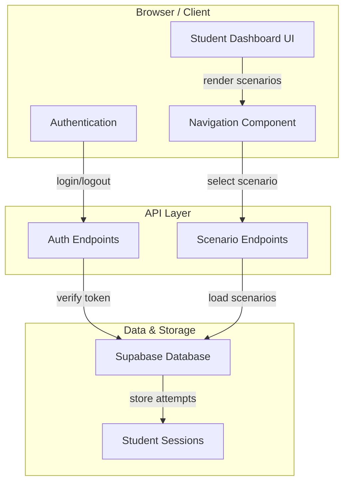

# Student Dashboard Architecture

**Responsibility:** Provides Training and Assessment navigation for students to access diagnostic scenarios.

## Overview

The Student Dashboard layer is responsible for presenting authenticated students with a navigable interface to select and launch training and assessment scenarios. It bridges between the public landing page and the diagnostic workflow engine.

## Architecture

## Key Responsibilities

### Training Navigation
- Display available training scenarios
- Track progress through training content
- Provide scenario restart/resume functionality
- Show learning progress metrics

### Assessment Navigation
- Display available assessment scenarios
- Restrict access based on prerequisite completion
- Track assessment attempts and scores
- Provide assessment result summary

### Student Context
- Maintain student session state
- Display student profile information
- Show historical attempts and results
- Provide account management options

## Components

| Component | Purpose | Location |
|-----------|---------|----------|
| Dashboard Container | Main student interface | `dashboard/student/Dashboard.jsx` |
| Scenario List | Lists available scenarios | `dashboard/student/ScenarioList.jsx` |
| Progress Tracker | Shows training/assessment progress | `dashboard/student/ProgressTracker.jsx` |
| Session Manager | Manages student sessions | `dashboard/student/SessionManager.js` |

## Security Model

- **Authentication:** OAuth/JWT required for all dashboard access
- **Authorization:** Students can only view their own attempts and authorized scenarios
- **Data Privacy:** Student responses and grades isolated per session
- **Session Timeout:** Automatic logout after 30 minutes of inactivity

## Related Documentation

- [Scenario Workflow](scenario/WORKFLOW.md) - Describes the diagnostic workflow within a scenario
- [API Architecture](../../torquemind-api/ARCHITECTURE.md) - Backend API design
- [System Architecture](../../docs/SYSTEM-ARCHITECTURE.md) - Overall system overview
