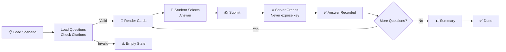

# Scenario Workflow

**Responsibility:** Describes the diagnostic scenario workflow from Question presentation through Student submission to automated Grading and Feedback generation.

## Overview

The Scenario Workflow orchestrates the complete student diagnostic experience: presenting questions, capturing responses, validating citations, grading answers, and delivering feedback. Each scenario is a series of diagnostic questions that test student knowledge and reasoning.

## Workflow



## Phase Details

### 1. Question Loading (Fail-Closed Security)
- **Input:** Scenario ID (e.g., `no-crank`)
- **Process:**
  - Query `question_provenance` table for approved questions
  - Load `question_citations` for each question
  - Check `citation_validations` table for proof of validation
  - Apply RLS policy: only return questions with `citation_validations.valid=true`
- **Output:** Array of Question objects with validated citations
- **Security:** Returns empty array if ANY question lacks validation proof
- **Concept:** Fail-Closed - Zero questions render when validation is incomplete

### 2. Render Questions (Production-Readiness Gate)
- **Input:** Questions array
- **Process:**
  - Render question card for each approved + validated question
  - Display question text, options, and supporting context
  - Enable submit button only when answer selected
- **Output:** Interactive question cards on page
- **Gate:** Only renders when `citation_validation.valid === true` for all questions
- **Concept:** Production-Readiness - All 20 questions render with proof of citation validity

### 3. Student Response Capture
- **Input:** Student interaction
- **Process:**
  - Listen for answer selection (radio button)
  - Validate input format matches question type
  - Display user-selected answer clearly
  - Disable option selection after submission
- **Output:** Selected response (e.g., "A", "B", "C", "D")
- **Concept:** Assessment - Captures student response for server grading

### 4. Response Submission & Server-Side Grading

Server-side grading is authoritative. The browser never calculates or determines correctness.

**Request:**
```javascript
POST /api/scenario-submissions/grade
{
  attempt_id: "uuid",                              // From URL params
  scenario_id: "no-crank",                         // Scenario key
  question_id: "question-uuid",                    // Question ID
  student_answer: "A|B|C|D",                       // Student's choice
  delivery_mode: "training|independent_non_proctored_assessment"
}
```

**Process:**
- Browser sends only the student's selected answer
- Server retrieves question and correct answer from secure database (service role)
- Server compares student answer against database-authoritative correct answer
- Server determines `is_correct` and generates explanation if applicable
- Server records submission in immutable `attempt_answers` table
- Server returns result without exposing correct answer

**Response (Training Mode):**
```javascript
{
  question_id: "uuid",
  is_correct: boolean,
  explanation: "...",  // Educational feedback
  ai_assistance_available: true,
  metadata: { delivery_mode: "training", graded_at: "...", server_verified: true }
}
```

**Response (Assessment Mode):**
```javascript
{
  question_id: "uuid",
  is_correct: boolean,
  explanation: null,   // No feedback in assessment mode
  ai_assistance_available: false,
  metadata: { delivery_mode: "independent_non_proctored_assessment", graded_at: "...", server_verified: true }
}
```

**Security Guarantees:**
- Correct answer is server-side secret, NEVER exposed to browser
- Browser cannot tamper with grading (no client-side calculation)
- Answer key never appears in DOM, requests, or responses
- Assessment mode hides all explanations and AI assistance until attempt finalized

### 5. Feedback Display (Mode-Dependent)

**Training Mode:**
- Show "Correct." or "Incorrect." immediately
- If incorrect, display educational explanation from server
- Allow student to retry or move to next question
- AI assistance available if tutor API is enabled

**Assessment Mode:**
- Show "Submitted." only (no correctness feedback)
- No explanations during attempt
- No AI assistance or tutoring
- Student proceeds to next question
- Feedback delayed until attempt completes and server finalizes score

- **Input:** Grading result from `/api/scenario-submissions/grade`
- **Process:**
  - In training mode: Display correctness and optional explanation
  - In assessment mode: Display only "Submitted." status
  - Disable answer modification after submission
- **Output:** User feedback message
- **Concept:** Learning (training) vs. Security (assessment)

## Data Flow

### Citation Validation Chain
```
Question → Citation → Source → Chunk → Validation Record
                ↓
         citation_validations table
         (valid=true only if ALL checks pass)
                ↓
         Dashboard filters by valid=true
                ↓
         Question card renders or stays hidden
```

### Question Structure
```javascript
{
  question_id: "no-crank-battery-health-01",
  question_provenance_id: "uuid",
  question_text: "...",
  answer_options: [...],
  answer_key: "A",
  citations: [
    {
      id: "uuid",
      source_id: "gm-no-crank-pi-2014",
      chunk_id: "gm-no-crank-battery-health",
      quote: "...",
      role: "supports-answer"
    }
  ],
  citation_validation: {
    valid: true,
    source_hashes_verified: true,
    excerpts_verified: true,
    urls_verified: true
  }
}
```

## Security Gates

### Fail-Closed Security Gate (tted805-no-crank-fail-closed)
- **When:** Citation validation records are MISSING
- **Expected Behavior:** 0 question cards render
- **Message:** "Question bank unavailable for grading"
- **Purpose:** Prevents rendering unauthenticated content
- **Status:** PASSING ✅

### Production-Readiness Gate (tted805-no-crank-production-readiness)
- **When:** Citation validation records ARE PRESENT with valid=true
- **Expected Behavior:** 20 question cards render with `citation_validation.valid === true`
- **Message:** No message (normal operation)
- **Purpose:** Verifies system is production-ready with valid citations
- **Status:** PENDING (waiting for validator to populate records)

## API Contracts

### GET /api/scenario-questions-approved?scenario_id=no-crank
**Response:**
```json
{
  "success": true,
  "questions": [
    {
      "question_id": "no-crank-battery-health-01",
      "question_provenance_id": "uuid",
      "question_text": "...",
      "answer_options": [...],
      "citations": [...],
      "citation_validation": {
        "valid": true,
        "source_hashes_verified": true,
        "excerpts_verified": true,
        "urls_verified": true,
        "result": "valid"
      }
    }
  ]
}
```

### POST /api/scenario-submissions/grade
**Authoritative Server-Side Grading Endpoint**

**Authentication:** Requires Supabase JWT in Authorization header

**Request:**
```json
{
  "attempt_id": "uuid",
  "scenario_id": "no-crank",
  "question_id": "question-uuid",
  "student_answer": "A|B|C|D",
  "delivery_mode": "training|independent_non_proctored_assessment"
}
```

**Response (Training Mode):**
```json
{
  "question_id": "uuid",
  "is_correct": true|false,
  "explanation": "Educational feedback text (null in assessment mode)",
  "ai_assistance_available": true,
  "metadata": {
    "delivery_mode": "training",
    "graded_at": "ISO-8601-timestamp",
    "server_verified": true
  }
}
```

**Response (Assessment Mode):**
```json
{
  "question_id": "uuid",
  "is_correct": true|false,
  "explanation": null,
  "ai_assistance_available": false,
  "metadata": {
    "delivery_mode": "independent_non_proctored_assessment",
    "graded_at": "ISO-8601-timestamp",
    "server_verified": true
  }
}
```

**Security Properties:**
- Correct answer is NEVER exposed in request or response
- Server performs grading from database-authoritative values
- Assessment mode suppresses explanations and AI assistance
- All submissions are recorded in immutable `attempt_answers` table for audit trail
- Score calculated from server-provided `is_correct` values only

## Concepts

- **Question** - Individual diagnostic question with multiple choice or constructed response
- **Submit** - Student action to submit their selected response for grading
- **Feedback** - Automated response explaining correctness and providing learning resources
- **Summary** - Final report showing total score and performance breakdown
- **Grading** - Automated scoring against answer keys with point calculation
- **Validation** - Citation validation ensuring quotes are authentic and correctly sourced

## Related Documentation

- [Student Dashboard](../ARCHITECTURE.md) - Navigation layer
- [API Layer](../../torquemind-api/ARCHITECTURE.md) - Backend API
- [Question Lifecycle](../../data/QUESTION-LIFECYCLE.md) - Question approval process
- [Citation Validator](../../scripts/CITATION-VALIDATOR.md) - Validation evidence generation
- [Database Schema](../../supabase/DATABASE-ARCHITECTURE.md) - Data model
- [Playwright Tests](../../tests/playwright/TEST-FLOWS.md) - E2E test coverage
