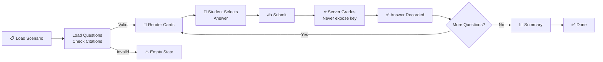

# Scenario Workflow

**Responsibility:** Describes the diagnostic scenario workflow from Question presentation through Student submission to automated Grading and Feedback generation.

## Overview

The Scenario Workflow orchestrates the complete student diagnostic experience: presenting questions, capturing responses, validating citations, grading answers, and delivering feedback. Each scenario is a series of diagnostic questions that test student knowledge and reasoning.

## Workflow



## Phase Details

### 1. Question Loading (Fail-Closed Security)
- **Input:** Scenario ID (e.g., `no-crank`)
- **Process:**
  - Query `question_provenance` table for approved questions
  - Load `question_citations` for each question
  - Check `citation_validations` table for proof of validation
  - Apply RLS policy: only return questions with `citation_validations.valid=true`
- **Output:** Array of Question objects with validated citations
- **Security:** Returns empty array if ANY question lacks validation proof
- **Concept:** Fail-Closed - Zero questions render when validation is incomplete

### 2. Render Questions (Production-Readiness Gate)
- **Input:** Questions array
- **Process:**
  - Render question card for each approved + validated question
  - Display question text, options, and supporting context
  - Enable submit button only when answer selected
- **Output:** Interactive question cards on page
- **Gate:** Only renders when `citation_validation.valid === true` for all questions
- **Concept:** Production-Readiness - All 20 questions render with proof of citation validity

### 3. Student Response Capture
- **Input:** Student interaction
- **Process:**
  - Listen for answer selection (radio button, checkbox, text input)
  - Validate input format matches question type
  - Display user-selected answer clearly
- **Output:** Selected response
- **Concept:** Assessment - Captures student reasoning and knowledge

### 4. Response Submission & Server-Side Grading
- **Input:** Student's selected answer ONLY
- **Process:**
  - Browser submits answer to `/api/scenario-submissions/grade`
  - Server retrieves question and correct answer from secure database
  - Server compares student answer against database-authoritative correct answer
  - Server returns grading result (is_correct boolean only)
  - Correct answer NEVER sent to client and NEVER stored in browser
- **Output:** Grading result (pass/fail status only, no answer key)
- **Security Guarantees:**
  - Correct answer is server-side secret, never exposed to browser
  - Browser cannot tamper with grading (no client-side calculation)
  - Answer key never appears in DOM or network responses

### 5. Feedback Display
- **Input:** Grading result
- **Process:**
  - Show if answer was correct or incorrect
  - Explain correct answer with citations
  - Provide remedial learning resources if needed
  - Display score for this question
- **Output:** Educational feedback
- **Concept:** Learning - Reinforces correct responses and explains reasoning

### 6. Scenario Summary
- **Input:** All responses + all grades
- **Process:**
  - Calculate total score across all questions
  - Show performance breakdown by topic
  - Display historical attempt comparison
- **Output:** Summary report
- **Concept:** Assessment - Provides complete performance snapshot

## Data Flow

### Citation Validation Chain
```
Question → Citation → Source → Chunk → Validation Record
                ↓
         citation_validations table
         (valid=true only if ALL checks pass)
                ↓
         Dashboard filters by valid=true
                ↓
         Question card renders or stays hidden
```

### Question Structure
```javascript
{
  question_id: "no-crank-battery-health-01",
  question_provenance_id: "uuid",
  question_text: "...",
  answer_options: [...],
  answer_key: "A",
  citations: [
    {
      id: "uuid",
      source_id: "gm-no-crank-pi-2014",
      chunk_id: "gm-no-crank-battery-health",
      quote: "...",
      role: "supports-answer"
    }
  ],
  citation_validation: {
    valid: true,
    source_hashes_verified: true,
    excerpts_verified: true,
    urls_verified: true
  }
}
```

## Security Gates

### Fail-Closed Security Gate (tted805-no-crank-fail-closed)
- **When:** Citation validation records are MISSING
- **Expected Behavior:** 0 question cards render
- **Message:** "Question bank unavailable for grading"
- **Purpose:** Prevents rendering unauthenticated content
- **Status:** PASSING ✅

### Production-Readiness Gate (tted805-no-crank-production-readiness)
- **When:** Citation validation records ARE PRESENT with valid=true
- **Expected Behavior:** 20 question cards render with `citation_validation.valid === true`
- **Message:** No message (normal operation)
- **Purpose:** Verifies system is production-ready with valid citations
- **Status:** PENDING (waiting for validator to populate records)

## API Contracts

### GET /api/scenario-questions-approved?scenario_id=no-crank
**Response:**
```json
{
  "success": true,
  "questions": [
    {
      "question_id": "no-crank-battery-health-01",
      "question_provenance_id": "uuid",
      "question_text": "...",
      "answer_options": [...],
      "citations": [...],
      "citation_validation": {
        "valid": true,
        "source_hashes_verified": true,
        "excerpts_verified": true,
        "urls_verified": true,
        "result": "valid"
      }
    }
  ]
}
```

### POST /api/grade-response
**Request:**
```json
{
  "question_id": "no-crank-battery-health-01",
  "student_response": "A",
  "session_id": "uuid"
}
```

**Response:**
```json
{
  "success": true,
  "correct": true,
  "score": 1,
  "feedback": "Correct! Your answer aligns with...",
  "explanation": "..."
}
```

## Concepts

- **Question** - Individual diagnostic question with multiple choice or constructed response
- **Submit** - Student action to submit their selected response for grading
- **Feedback** - Automated response explaining correctness and providing learning resources
- **Summary** - Final report showing total score and performance breakdown
- **Grading** - Automated scoring against answer keys with point calculation
- **Validation** - Citation validation ensuring quotes are authentic and correctly sourced

## Related Documentation

- [Student Dashboard](../ARCHITECTURE.md) - Navigation layer
- [API Layer](../../torquemind-api/ARCHITECTURE.md) - Backend API
- [Question Lifecycle](../../data/QUESTION-LIFECYCLE.md) - Question approval process
- [Citation Validator](../../scripts/CITATION-VALIDATOR.md) - Validation evidence generation
- [Database Schema](../../supabase/DATABASE-ARCHITECTURE.md) - Data model
- [Playwright Tests](../../tests/playwright/TEST-FLOWS.md) - E2E test coverage
