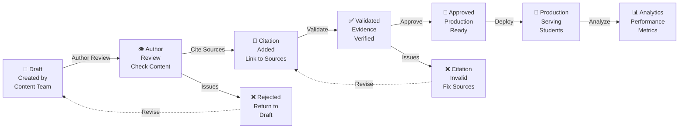

# Question Lifecycle

**Responsibility:** Documents the complete lifecycle of diagnostic questions from Draft creation through Citation validation to Approved production status.

## Overview

Questions progress through a controlled lifecycle ensuring accuracy, proper sourcing, and production readiness before being served to students. Each stage enforces specific validation criteria and requires evidence of correctness.

## Lifecycle States



## State Details

### 1. Draft
- **Status:** `draft` (default)
- **Created By:** Content author
- **Stored In:** `question_provenance` table with `status = 'draft'`
- **Contains:**
  - Question text and learning objectives
  - Answer options (multiple choice, constructed response, etc.)
  - Answer key and scoring rubric
  - Initial difficulty rating
  - Subject area tags
- **Purpose:** Initial content creation before sourcing
- **Transition Criteria:** Author indicates content is ready for citation review

### 2. Citation Addition
- **Status:** `draft` → requires citations
- **Actions:** 
  - Author identifies authoritative sources
  - Creates `question_citations` records linking to `approved_sources`
  - Each citation includes quote, source ID, chunk ID, and role
- **Validation:**
  - Source must be `approved` status
  - Quote must exist in source chunk
  - Chunk must be `approved` status
  - Citations support both answer explanation and learning context
- **Stored In:** `question_citations` table
- **Transition Criteria:** All questions have at least one citation

### 3. Validation
- **Status:** `validated` (new status)
- **Validator:** Automated deterministic validator (`scripts/validate-citations.js`)
- **Checks:**
  - Source approval status verified
  - Chunk approval status verified
  - Quote text matches source chunk (normalized)
  - Text hash (SHA-256) verified
  - URL/source path verified
  - All citation roles present (answer + explanation)
- **Evidence Generated:** Stored in `citation_validations` table
  - `source_hashes_verified`: true/false
  - `excerpts_verified`: true/false
  - `urls_verified`: true/false
  - `result`: 'valid' or 'invalid'
  - `errors`: array of validation failures
  - `validated_at`: timestamp
- **Purpose:** Automated proof that all citations are authentic and properly sourced
- **Transition Criteria:** Validator returns 0 invalid questions

### 4. Approved
- **Status:** `approved`
- **Approval Process:**
  - Instructor review of question content
  - Confirmation that validation passed
  - Manual sign-off on learning objectives
- **Stored In:** `question_provenance.status = 'approved'`
- **Visibility:** Questions now available for dashboard to load
- **Security Gate:** RLS policy filters to `status = 'approved'`
- **Transition Criteria:** Instructor explicitly approves question

### 5. Production
- **Status:** `approved` + `citation_validations.valid = true`
- **When Questions Render:**
  1. API queries `question_provenance` where `status = 'approved'`
  2. Checks `citation_validations` where `valid = true`
  3. RLS policy enforces fail-closed security
  4. Only questions with validation evidence are visible
- **Student Experience:**
  - Questions render in dashboard with full citations
  - Answer keys are hidden until submission
  - Feedback includes citation evidence
- **Monitoring:**
  - Track question difficulty (% correct answers)
  - Monitor student time-on-task
  - Collect feedback on question clarity

### 6. Analytics
- **Metrics Collected:**
  - Number of students who attempted question
  - Percentage correct
  - Average time spent
  - Student feedback
  - Common misconceptions
- **Purpose:** Continuous improvement and learning outcome tracking
- **Actions:**
  - Identify poorly performing questions (< 40% correct)
  - Recognize highly effective questions (> 80% correct)
  - Plan revisions for low-performing questions

## Database Schema

### question_provenance
```sql
Table: question_provenance
├── id (UUID, PK)
├── question_id (text, unique): "no-crank-battery-health-01"
├── status (text): 'draft' | 'validated' | 'approved'
├── question_text (text): Full question content
├── answer_options (jsonb): ["A", "B", "C", "D"]
├── answer_key (text): "A"
├── difficulty_rating (integer): 1-5
├── subject_area (text): "Electrical Systems"
├── created_by (UUID, FK)
├── created_at (timestamptz)
├── approved_by (UUID, FK)
└── approved_at (timestamptz)
```

### question_citations
```sql
Table: question_citations
├── id (UUID, PK)
├── question_provenance_id (UUID, FK → question_provenance)
├── source_id (text, FK → approved_sources)
├── chunk_id (text, FK → source_chunks)
├── quote (text): Excerpt from source
├── role (text): 'supports-answer' | 'provides-context' | 'explains-reasoning'
├── locator (text): "Instructions, steps 4-5"
└── created_at (timestamptz)
```

### citation_validations
```sql
Table: citation_validations
├── id (UUID, PK)
├── question_provenance_id (UUID, FK → question_provenance)
├── validator_version (text): "citation-validator-1.0"
├── validation_method (text): "deterministic-source-chunk-verification"
├── source_hashes_verified (boolean)
├── excerpts_verified (boolean)
├── urls_verified (boolean)
├── result (text): 'valid' | 'invalid'
├── errors (jsonb): ["Error 1", "Error 2"]
├── validated_at (timestamptz)
└── UNIQUE(question_provenance_id, validator_version)
```

## Validator Flow

```
Input: 20 approved questions

For each question:
  1. Load citations from question_citations
  2. For each citation:
     a. Fetch source (must be approved)
     b. Fetch chunk (must be approved)
     c. Normalize quote text (trim, lowercase, collapse whitespace)
     d. Recompute SHA-256 hash of chunk text
     e. Compare computed hash vs stored chunk.text_hash
     f. Verify URL/source path
  3. Set verification flags:
     - source_hashes_verified = all hashes match
     - excerpts_verified = all quotes match
     - urls_verified = all URLs valid
  4. Set result:
     - result = 'valid' if all flags are true
     - result = 'invalid' if any check fails
  5. Upsert to citation_validations table

Output: 
  - Valid: 20/20 (production ready)
  - Invalid: 0/20 (no blocking issues)
```

## Security Principles

### Fail-Closed Authentication
- Questions only render when citation validation records explicitly prove validity
- Missing validation records → questions excluded from view
- Invalid validation records → questions excluded from view
- Zero questions render until complete validation evidence exists

### Citation Evidence Trail
- Every validation check is recorded with computed evidence
- No hardcoded "valid = true" assignments
- All verification results are reproducible and auditable
- Hash mismatches are captured and reported

### Source Authority
- Only questions citing approved authoritative sources are considered
- Unapproved sources are excluded regardless of content quality
- Source approval is separate from citation validation
- Content team controls which publishers are authoritative

## Validation Pipeline

```
Approved Questions
       ↓
   Validator Script
   (validate-citations.js)
       ↓
   Check each citation against source/chunk
       ↓
   Compute evidence for each verification
       ↓
   Upsert to citation_validations
       ↓
citation_validations (populated)
       ↓
   API queries for questions
       ↓
   RLS policy filters by valid=true
       ↓
   Questions visible to students
```

## Concepts

- **Draft** - Initial question content before sourcing
- **Validated** - Citations verified through deterministic validation
- **Approved** - Content team sign-off on accuracy
- **Citation** - Link to authoritative source proving claim
- **Provenance** - Complete audit trail of question approval
- **Evidence** - Computed hashes and validation results for auditing

## Related Documentation

- [API Architecture](../torquemind-api/ARCHITECTURE.md) - API endpoints for question loading
- [Scenario Workflow](../dashboard/student/scenario/WORKFLOW.md) - How questions are presented
- [Citation Validator](../scripts/CITATION-VALIDATOR.md) - Validation implementation
- [Database Schema](../supabase/DATABASE-ARCHITECTURE.md) - Underlying database
- [Playwright Tests](../tests/playwright/TEST-FLOWS.md) - Test coverage
