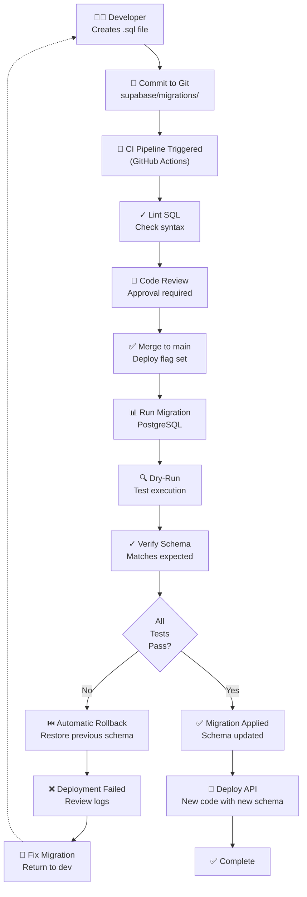

# Migration Flow

**Responsibility:** Manages PostgreSQL schema evolution through version-controlled migrations with execution order, rollback strategy, and CI/CD integration.

## Overview

Database migrations are executed in strict order to evolve the PostgreSQL schema. Each migration is atomic (all-or-nothing) and can be rolled back. Migrations are applied during CI/CD deployments and must complete successfully before code deployment.

## Migration Pipeline



## Migration Lifecycle

### Phase 1: Development
```bash
# Create migration file with timestamp
# Format: YYYYMMDD-description.sql
$ touch supabase/migrations/20260813-create-citation-validations.sql

# Write migration SQL
$ cat > supabase/migrations/20260813-create-citation-validations.sql << 'EOF'
CREATE TABLE citation_validations (
  id UUID PRIMARY KEY DEFAULT gen_random_uuid(),
  ...
);

CREATE POLICY "citation_validations_select"
ON citation_validations
FOR SELECT
TO authenticated
USING (result = 'valid' AND all_flags = true);
EOF

# Test locally against test database
$ supabase start
$ supabase db push
```

### Phase 2: Commit & Push
```bash
# Stage migration file
$ git add supabase/migrations/20260813-create-citation-validations.sql

# Commit with descriptive message
$ git commit -m "Add citation_validations table with RLS policy"

# Push to feature branch
$ git push origin feature/tted805-citation-validator
```

### Phase 3: CI Pipeline
CI runs automatically on push:

```yaml
# .github/workflows/database-migration-check.yml
name: Database Migration Check

on: [push, pull_request]

jobs:
  migration-lint:
    runs-on: ubuntu-latest
    steps:
      - uses: actions/checkout@v3
      
      - name: Lint SQL migrations
        run: |
          sqlparse supabase/migrations/*.sql
          
      - name: Check migration order
        run: |
          ls -la supabase/migrations/
          # Verify YYYYMMDD timestamp format
          
      - name: Verify schema compatibility
        run: npm run db:verify-schema

  migration-test:
    runs-on: ubuntu-latest
    services:
      postgres:
        image: postgres:14
        
    steps:
      - uses: actions/checkout@v3
      
      - name: Create test database
        run: createdb test_torquemind
        
      - name: Apply all migrations
        run: |
          for migration in supabase/migrations/*.sql; do
            psql -d test_torquemind < "$migration"
          done
          
      - name: Run schema tests
        run: npm run db:test
        
      - name: Verify RLS policies
        run: npm run db:verify-rls
```

### Phase 4: Code Review
```
PR opened → Reviewers examine migration
  ├─ SQL syntax correct?
  ├─ Matches documented schema?
  ├─ RLS policies complete?
  ├─ Backward compatible?
  ├─ Performance impact acceptable?
  └─ Rollback plan documented?
```

### Phase 5: Merge & Deploy
When PR is merged to `main`:

```bash
# Deployment system detects new migration
$ supabase db push --linked
# (or via Supabase CLI in CI)

# Logs show:
# ✓ Connecting to production database
# ✓ Applying migration 20260813-create-citation-validations.sql
# ✓ Schema verification passed
# ✓ RLS policies created
# ✓ Indexes built
# ✓ Migration complete
```

## Migration Structure

### Standard Template
```sql
-- Migration: 20260813-create-citation-validations.sql
-- Purpose: Add citation validation evidence tracking
-- Author: Development Team
-- Date: 2026-08-13

-- ============================================================================
-- CREATE TABLE: citation_validations
-- ============================================================================
-- Purpose: Store evidence that citations are valid and properly sourced
-- Dependency: Requires question_provenance table

CREATE TABLE citation_validations (
  id UUID PRIMARY KEY DEFAULT gen_random_uuid(),
  question_provenance_id UUID NOT NULL REFERENCES question_provenance(id) ON DELETE CASCADE,
  validator_version TEXT NOT NULL,
  validation_method TEXT DEFAULT 'deterministic-source-chunk-verification',
  source_hashes_verified BOOLEAN NOT NULL DEFAULT FALSE,
  excerpts_verified BOOLEAN NOT NULL DEFAULT FALSE,
  urls_verified BOOLEAN NOT NULL DEFAULT FALSE,
  result TEXT NOT NULL CHECK (result IN ('valid', 'invalid')),
  errors JSONB DEFAULT '[]'::JSONB,
  validated_at TIMESTAMPTZ DEFAULT NOW(),
  UNIQUE(question_provenance_id, validator_version)
);

-- ============================================================================
-- CREATE INDEXES
-- ============================================================================
CREATE INDEX idx_citation_validations_question_id 
ON citation_validations(question_provenance_id);

CREATE INDEX idx_citation_validations_result 
ON citation_validations(result);

-- ============================================================================
-- CREATE RLS POLICY
-- ============================================================================
ALTER TABLE citation_validations ENABLE ROW LEVEL SECURITY;

CREATE POLICY "citation_validations_select_policy"
ON citation_validations
FOR SELECT
TO authenticated
USING (
  result = 'valid'
  AND source_hashes_verified = true
  AND excerpts_verified = true
  AND urls_verified = true
);

-- ============================================================================
-- VERIFICATION
-- ============================================================================
-- Run these queries to verify migration success:
-- SELECT COUNT(*) FROM citation_validations;  -- Should be 0 initially
-- SELECT * FROM information_schema.tables WHERE table_name = 'citation_validations';
```

## Execution Order

Migrations execute in alphabetical order (enforced by timestamp YYYYMMDD prefix):

```
supabase/migrations/
├── 20260801-initial-schema.sql           (1st)
├── 20260802-add-question-provenance.sql  (2nd)
├── 20260803-add-citations.sql            (3rd)
├── 20260804-add-rls-policies.sql         (4th)
├── ...
└── 20260813-create-citation-validations.sql (current)

Each migration executes atomically:
  - All statements execute in transaction
  - If any statement fails: ROLLBACK entire migration
  - Previous schema state is restored
  - Deployment halted (code is not deployed)
```

## Rollback Strategy

### Automatic Rollback
If migration fails:
```sql
-- CI system automatically rolls back
ROLLBACK;

-- Schema reverts to previous state
-- Database is safe and consistent
```

### Manual Rollback (if needed)
```bash
# Create a rollback migration
$ cat > supabase/migrations/20260814-rollback-citation-validations.sql << 'EOF'
DROP POLICY IF EXISTS citation_validations_select_policy ON citation_validations;
DROP INDEX IF EXISTS idx_citation_validations_result;
DROP INDEX IF EXISTS idx_citation_validations_question_id;
DROP TABLE IF EXISTS citation_validations;
EOF

# Apply rollback migration
$ supabase db push
```

## Verification Queries

After migration applies, verify schema:

```sql
-- Verify table created
SELECT tablename FROM pg_tables 
WHERE tablename = 'citation_validations';

-- Verify columns exist
SELECT column_name, data_type 
FROM information_schema.columns 
WHERE table_name = 'citation_validations';

-- Verify indexes created
SELECT indexname FROM pg_indexes 
WHERE tablename = 'citation_validations';

-- Verify RLS policies enabled
SELECT * FROM pg_policies 
WHERE tablename = 'citation_validations';

-- Verify unique constraint
SELECT constraint_name FROM information_schema.table_constraints 
WHERE table_name = 'citation_validations' 
AND constraint_type = 'UNIQUE';
```

## Performance Considerations

### Indexes
```sql
-- Create indexes for frequently queried columns
CREATE INDEX idx_citation_validations_question_id 
  ON citation_validations(question_provenance_id);

CREATE INDEX idx_citation_validations_result 
  ON citation_validations(result);

-- Composite index for common filter pattern
CREATE INDEX idx_citation_validations_valid 
  ON citation_validations(result, source_hashes_verified, excerpts_verified, urls_verified)
  WHERE result = 'valid';
```

### Large Data Imports
```sql
-- For bulk inserts, use CONCURRENTLY to avoid lock contention
CREATE INDEX CONCURRENTLY idx_bulk_insert 
ON citation_validations(validated_at);
```

## Testing Migrations

### Local Testing
```bash
# Start local Supabase with test database
$ supabase start

# Test migration applies
$ supabase db push

# Run schema validation
$ npm run db:verify-schema

# Run data integrity tests
$ npm run db:test
```

### CI Testing
```bash
# Automatic in GitHub Actions
# - Lints SQL
# - Creates test database
# - Applies all migrations
# - Runs verification queries
# - Tests RLS policies
```

## CI/CD Integration

### GitHub Actions Workflow
```yaml
name: Deploy Database

on:
  push:
    branches: [main]
    paths: ['supabase/migrations/**', 'package.json']

jobs:
  database-deploy:
    runs-on: ubuntu-latest
    
    steps:
      - uses: actions/checkout@v3
      
      - name: Install Supabase CLI
        run: npm install -g supabase
        
      - name: Apply migrations
        run: |
          supabase db push --linked
        env:
          SUPABASE_ACCESS_TOKEN: ${{ secrets.SUPABASE_ACCESS_TOKEN }}
          SUPABASE_PROJECT_ID: ${{ secrets.SUPABASE_PROJECT_ID }}
          
      - name: Verify schema
        run: npm run db:verify
        env:
          SUPABASE_URL: ${{ secrets.SUPABASE_URL }}
          SUPABASE_ANON_KEY: ${{ secrets.SUPABASE_ANON_KEY }}
```

## Concepts

- **Migration** - Atomic SQL script that evolves database schema
- **PostgreSQL** - Relational database engine
- **RLS** - Row Level Security policies enforced by database
- **CI** - Continuous Integration pipeline
- **Rollback** - Restore previous schema state if migration fails
- **Atomic** - All statements in migration execute together or not at all

## Related Documentation

- [Database Schema](../supabase/DATABASE-ARCHITECTURE.md) - Schema design
- [Citation Validator](../scripts/CITATION-VALIDATOR.md) - Populates citation_validations
- [Question Lifecycle](../data/QUESTION-LIFECYCLE.md) - Approval workflow
- [API Architecture](../torquemind-api/ARCHITECTURE.md) - API query logic
- [Test Flows](../tests/playwright/TEST-FLOWS.md) - E2E test coverage
