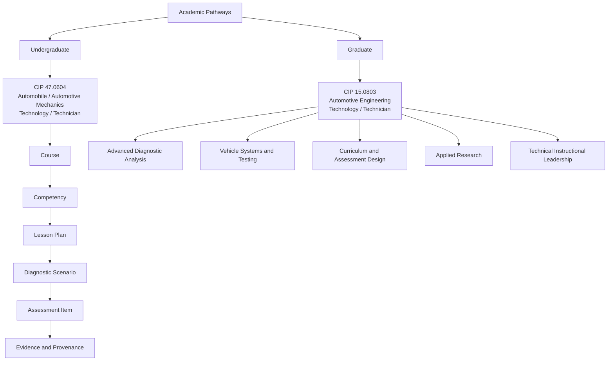

# Academic Pathways Architecture

AutoLearnPro separates academic level from CIP classification. Undergraduate and Graduate are top-level pathways; each pathway then carries the relevant disciplinary CIP and downstream learning structure.

## Curriculum data contract

The canonical curriculum layer lives in `data/curriculum/`:

- `academic-pathways.json` — academic level and program/CIP assignment
- `undergraduate-courses.json` — undergraduate course records
- `graduate-courses.json` — graduate course records
- `competencies.json` — course-linked competencies
- `lesson-plans.json` — competency-linked lesson plans
- `scenario-mappings.json` — live scenario-to-curriculum mappings

`data/scenario-curriculum.js` remains a browser compatibility layer for current scenario pages. `npm run validate:academic-pathways` verifies that the compatibility data and canonical curriculum contract remain aligned.
