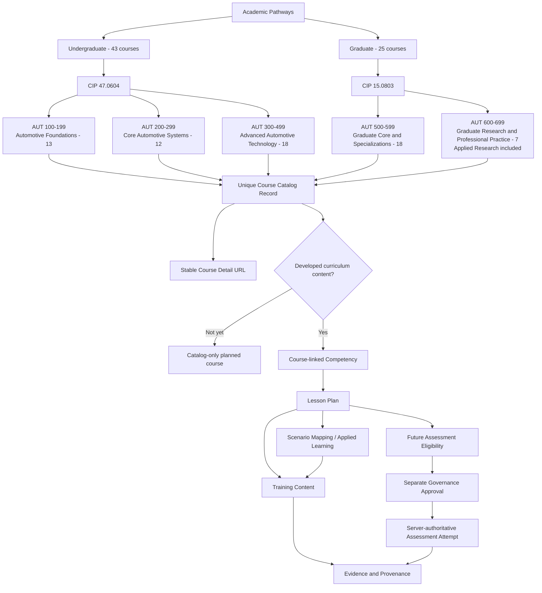

# Academic Pathways Architecture

AutoLearnPro separates academic level from CIP classification. Undergraduate and Graduate are top-level pathways; each pathway then carries the relevant disciplinary CIP and downstream learning structure.

The academic catalog defines **68 unique courses total: 43 undergraduate and 25 graduate**. Catalog coverage is separate from developed lesson coverage: a course may exist in the catalog before a competency, lesson plan, scenario, or training package has been authored and governed.

```mermaid
flowchart TD
  A[Academic Pathways] --> U[Undergraduate - 43 courses]
  A --> G[Graduate - 25 courses]

  U --> U47[CIP 47.0604]
  U47 --> U100[AUT 100-199<br/>Automotive Foundations - 13]
  U47 --> U200[AUT 200-299<br/>Core Automotive Systems - 12]
  U47 --> U300[AUT 300-499<br/>Advanced Automotive Technology - 18]

  G --> G15[CIP 15.0803]
  G15 --> G500[AUT 500-599<br/>Graduate Core and Specializations - 18]
  G15 --> G600[AUT 600-699<br/>Graduate Research and Professional Practice - 7<br/>Applied Research included]

  U100 --> CAT[Unique Course Catalog Record]
  U200 --> CAT
  U300 --> CAT
  G500 --> CAT
  G600 --> CAT

  CAT --> URL[Stable Course Detail URL]
  CAT --> D{Developed curriculum content?}
  D -->|Not yet| P[Catalog-only planned course]
  D -->|Yes| C[Course-linked Competency]
  C --> L[Lesson Plan]
  L --> S[Scenario Mapping / Applied Learning]
  L --> T[Training Content]
  S --> T
  T --> E[Evidence and Provenance]

  L --> AE[Future Assessment Eligibility]
  AE --> AG[Separate Governance Approval]
  AG --> AA[Server-authoritative Assessment Attempt]
  AA --> E
```

The catalog is the unique academic-course inventory. The developed curriculum files remain a governed delivery subset until each catalog course receives authored competency and lesson content. Production API parity for that developed subset is verified separately.

## Curriculum data contract

The canonical curriculum layer lives in `data/curriculum/`:

- `academic-pathways.json` — academic level and program/CIP assignment
- `course-catalog.json` — unique 68-course academic catalog and stable course URLs
- `undergraduate-courses.json` — developed undergraduate curriculum subset
- `graduate-courses.json` — developed graduate curriculum subset
- `competencies.json` — course-linked competencies
- `lesson-plans.json` — competency-linked lesson plans
- `scenario-mappings.json` — live scenario-to-curriculum mappings

`data/scenario-curriculum.js` remains a browser compatibility layer for current scenario pages. `npm run validate:academic-pathways` verifies that the compatibility data and canonical curriculum contract remain aligned.
