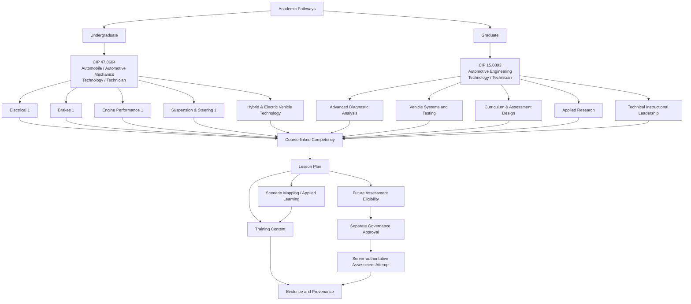

# Academic Pathways Architecture

AutoLearnPro separates academic level from CIP classification. Undergraduate and Graduate are top-level pathways; each pathway then carries the relevant disciplinary CIP and downstream learning structure.

The canonical curriculum currently defines **10 courses total: 5 undergraduate and 5 graduate**.

```mermaid
flowchart TD
  A[Academic Pathways] --> U[Undergraduate]
  A --> G[Graduate]

  U --> U47[CIP 47.0604<br/>Automobile / Automotive Mechanics<br/>Technology / Technician]
  U47 --> UE[Electrical 1]
  U47 --> UB[Brakes 1]
  U47 --> UEP[Engine Performance 1]
  U47 --> USS["Suspension & Steering 1"]
  U47 --> UHEV["Hybrid & Electric Vehicle Technology"]

  G --> G15[CIP 15.0803<br/>Automotive Engineering<br/>Technology / Technician]
  G15 --> GA[Advanced Diagnostic Analysis]
  G15 --> GT[Vehicle Systems and Testing]
  G15 --> GC["Curriculum & Assessment Design"]
  G15 --> GR[Applied Research]
  G15 --> GL[Technical Instructional Leadership]

  UE --> C[Course-linked Competency]
  UB --> C
  UEP --> C
  USS --> C
  UHEV --> C
  GA --> C
  GT --> C
  GC --> C
  GR --> C
  GL --> C

  C --> L[Lesson Plan]
  L --> S[Scenario Mapping / Applied Learning]
  L --> T[Training Content]
  S --> T
  T --> E[Evidence and Provenance]

  L --> AE[Future Assessment Eligibility]
  AE --> AG[Separate Governance Approval]
  AG --> AA[Server-authoritative Assessment Attempt]
  AA --> E
```

The pathway diagram represents the canonical repository curriculum. Production API parity is verified separately so a deployment can fail visibly if its served curriculum falls behind the canonical data.

## Curriculum data contract

The canonical curriculum layer lives in `data/curriculum/`:

- `academic-pathways.json` — academic level and program/CIP assignment
- `undergraduate-courses.json` — undergraduate course records
- `graduate-courses.json` — graduate course records
- `competencies.json` — course-linked competencies
- `lesson-plans.json` — competency-linked lesson plans
- `scenario-mappings.json` — live scenario-to-curriculum mappings

`data/scenario-curriculum.js` remains a browser compatibility layer for current scenario pages. `npm run validate:academic-pathways` verifies that the compatibility data and canonical curriculum contract remain aligned.
