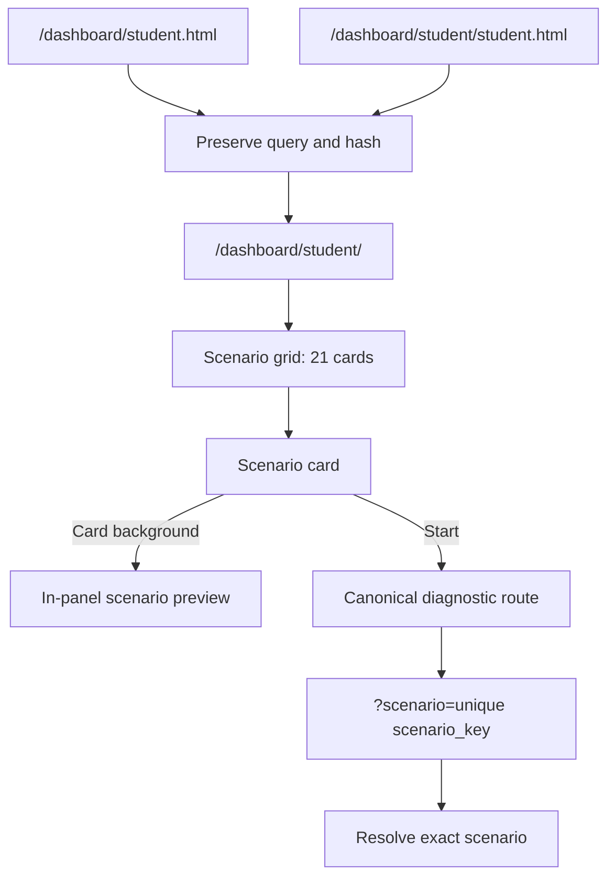
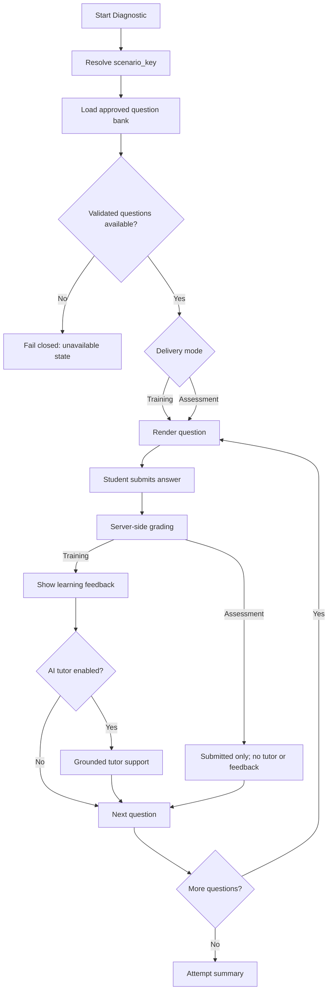

# Student Production UX and Diagnostic Workflow

**Status:** Production behavior as of the 21-scenario catalog and legacy-entrypoint consolidation.

## Student Entry and Scenario Selection

## Diagnostic Workflow

## Contracts

- The canonical student dashboard is `/dashboard/student/`.
- Legacy student URLs redirect while preserving query parameters and hashes.
- Scenarios resolve through a unique `scenario_key`.
- Training feedback and AI tutoring are mode-dependent.
- Assessment mode does not expose tutoring, answer explanations, or answer keys during an attempt.
- Question availability remains fail-closed when approval or citation validation is unavailable.
