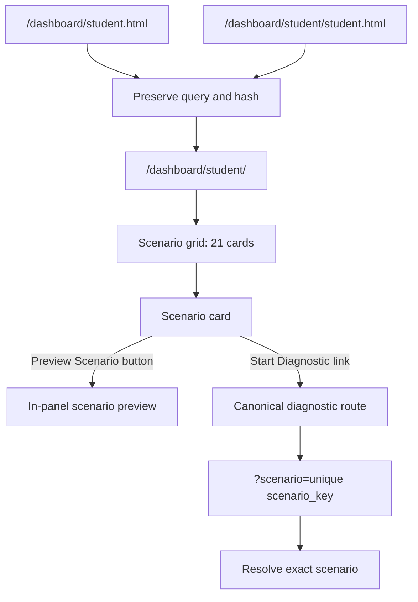
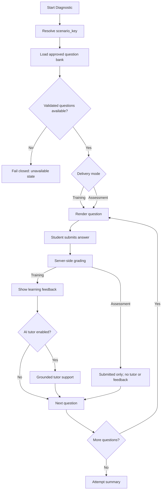

# Student Production UX and Diagnostic Workflow

**Status:** Production behavior as of the 21-scenario catalog and legacy-entrypoint consolidation.

## Student Entry and Scenario Selection

## Diagnostic Workflow

## Contracts

- **Canonical student dashboard**: `/dashboard/student/` with 21-card scenario grid.
- **Legacy student URLs**: `/dashboard/student.html` and `/dashboard/student/student.html` redirect to canonical dashboard while preserving query parameters and hashes.
- **Diagnostic route**: `/dashboard/student/scenario/?scenario=<scenario_key>&mode=<training|assessment>` resolves via unique `scenario_key`.
- **Training mode**: Provides learning feedback after each answer and enables optional AI tutor support when enabled.
- **Assessment mode**: Submitted answers only; no tutoring, explanations, or answer keys exposed during the attempt.
- **Fail-closed availability**: Question availability remains blocked if approval or citation validation systems are unavailable.
