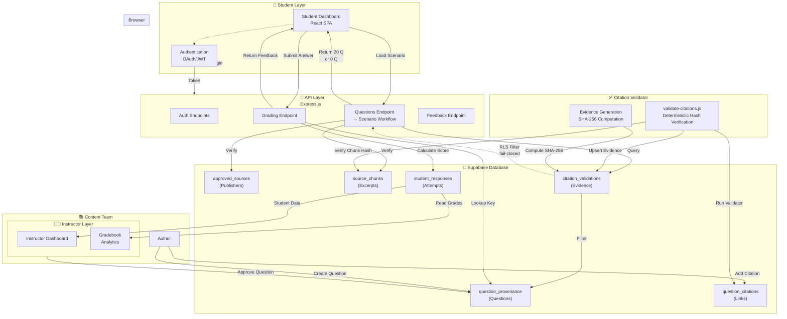

# TorqueMind System Architecture

**Responsibility:** Describes the overall end-to-end system architecture connecting Student dashboard, API, database, and citation validation workflows.

## Overview

TorqueMind is a diagnostic learning platform that delivers automotive repair scenarios to students, validates educational content through cryptographic citation verification, and provides intelligent feedback. The architecture emphasizes fail-closed security, academic integrity, and student privacy.

## System Architecture



## Architecture Layers

### 1. Student Dashboard Layer

**Component:** `dashboard/student/`

**Responsibility:** Present interactive training and assessment scenarios to authenticated students.

**Key Files:**
- `dashboard/student/ARCHITECTURE.md` - Navigation design
- `dashboard/student/scenario/WORKFLOW.md` - Diagnostic workflow

**Flow:**
```
Student Login
    ↓
Select Scenario
    ↓
API: Load Approved + Validated Questions
    ↓
Render 20 Question Cards (or 0 if validation missing)
    ↓
Student Selects Answer
    ↓
Submit to API
    ↓
API: Grade Response + Generate Feedback
    ↓
Display Feedback to Student
    ↓
Next Question or Summary
```

**Security:**
- Authentication required (JWT token)
- Student can only view their own attempts
- Answer keys hidden until submission
- Fail-closed: Questions excluded if citation validation missing

### 2. API Layer

**Component:** `torquemind-api/`

**Responsibility:** Express.js server implementing question loading, grading, and fail-closed security.

**Key Files:**
- `torquemind-api/ARCHITECTURE.md` - API design and endpoints

**Core Endpoints:**
```
POST   /auth/login                 → JWT token
POST   /auth/logout                → Invalidate token
GET    /api/scenario-questions-approved?scenario_id=X → 0-20 questions
POST   /api/grade-response         → Grading result + feedback
GET    /api/feedback/:question_id  → Learning resources
```

**Fail-Closed Security:**
```javascript
// Pseudo-code: GET /api/scenario-questions-approved
const questions = await db.question_provenance
  .where({ status: 'approved', scenario_id: X })
  .select();

for (const q of questions) {
  // Check if validation exists
  const validation = await db.citation_validations
    .where({ question_provenance_id: q.id, result: 'valid' })
    .select();  // RLS filters to valid=true only
    
  if (validation.length === 0) {
    // Citation validation missing → exclude question
    continue;
  }
  
  if (!validation[0].all_checks_pass) {
    // Citation validation failed → exclude question
    continue;
  }
  
  // Include question with validation evidence
  result.push({
    ...q,
    citation_validation: validation[0]
  });
}

// If any question is excluded, result has < 20 questions
return result;
```

### 3. Question Data Layer

**Component:** `data/`

**Responsibility:** Manage question lifecycle from draft through approval.

**Key Files:**
- `data/QUESTION-LIFECYCLE.md` - Approval workflow

**Question Progression:**
```
Draft (Author creates)
  ↓
Citation (Author adds sources)
  ↓
Validated (Validator runs; evidence generated)
  ↓
Approved (Instructor approves)
  ↓
Production (Questions render if citation_validations.valid = true)
  ↓
Analytics (Performance tracking)
```

**Key Concept:** Every question must have proof in `citation_validations` table before it can render to students.

### 4. Citation Validator

**Component:** `scripts/validate-citations.js`

**Responsibility:** Deterministic verification that citations are authentic and properly sourced.

**Key Files:**
- `scripts/CITATION-VALIDATOR.md` - Validator design

**Validation Process:**
```
For each approved question:
  ├─ Load citations from DB
  ├─ For each citation:
  │  ├─ Load source (must be approved)
  │  ├─ Load chunk (must be approved)
  │  ├─ Normalize and compare quote text
  │  ├─ Compute SHA-256 hash of chunk
  │  ├─ Compare hash vs canonical
  │  └─ Verify source URL exists
  └─ If all checks pass:
      └─ Upsert citation_validations record with valid=true

Result: 20 valid questions ready for dashboard to load
```

**Command:**
```bash
SUPABASE_URL="..." SUPABASE_SERVICE_KEY="..." \
node scripts/validate-citations.js --scenario no-crank
```

### 5. Database Layer

**Component:** `supabase/` + `db/migrations/`

**Responsibility:** PostgreSQL schema with RLS policies enforcing fail-closed security.

**Key Files:**
- `supabase/DATABASE-ARCHITECTURE.md` - Schema design
- `db/migrations/MIGRATION-FLOW.md` - Migration workflow

**Critical Table: `citation_validations`**
```sql
-- RLS Policy: Fail-Closed
CREATE POLICY "Only return valid citations"
ON citation_validations
FOR SELECT
USING (
  result = 'valid'
  AND source_hashes_verified = true
  AND excerpts_verified = true
  AND urls_verified = true
);
```

**Behavior:**
- When API queries this table → RLS policy automatically filters
- Missing records → 0 rows returned
- Invalid records (result='invalid') → 0 rows returned
- Only valid records with all flags=true are visible

### 6. Playwright Tests

**Component:** `tests/playwright/`

**Responsibility:** E2E validation of fail-closed security and production-readiness gates.

**Key Files:**
- `tests/playwright/TEST-FLOWS.md` - Test design

**Two Critical Tests:**
```
Test 1: Fail-Closed Security
├─ Setup: citation_validations table EMPTY
├─ Navigate: Load scenario dashboard
├─ Assert: 0 question cards render
├─ Assert: "Unavailable" message displays
└─ Status: ✅ PASSING

Test 2: Production-Readiness
├─ Setup: citation_validations table POPULATED (20 valid records)
├─ Navigate: Load scenario dashboard
├─ Assert: 20 question cards render
├─ Assert: Each has valid=true for all verification flags
└─ Status: ⏳ FAILING (waiting for validator to populate records)
```

## Data Flow: Question to Student

### Step 1: Question Approved
```
Author: Creates question text + answer key
Instructor: Reviews and approves
Database: question_provenance.status = 'approved'
```

### Step 2: Citations Added
```
Author: Adds citations linking question to sources
Database: question_citations records created
Each citation points to:
  - source_id (approved_sources table)
  - chunk_id (source_chunks table)
  - quote (excerpt from chunk)
```

### Step 3: Validation Runs
```
Validator Script: 
  ├─ Loads all approved questions
  ├─ For each question, verifies all citations
  └─ Upserts to citation_validations table
  
Result: 
  - If all citations valid → result='valid', all flags=true
  - If any citation invalid → result='invalid', errors recorded
```

### Step 4: Questions Visible to API
```
API endpoint queries:
  SELECT * FROM question_provenance WHERE status='approved'
  
Then checks:
  SELECT * FROM citation_validations 
  WHERE question_provenance_id = $1 AND result='valid'
  
RLS policy filters:
  Only returns records where ALL verification flags = true
  
Result:
  - If validation record exists and valid → include question
  - If validation record missing or invalid → exclude question
```

### Step 5: Dashboard Renders
```
Dashboard receives API response:
  - If 20 questions → Render 20 cards
  - If 0 questions → Show "Unavailable" message

Student selects answer and submits
API grades response and returns feedback
Dashboard shows educational feedback with citations
```

### Step 6: Student Completes Scenario
```
Dashboard sums scores across all questions
Displays summary report
Stores attempt in student_responses table
```

## Security Architecture

### Fail-Closed Security
**Principle:** Deny by default; only grant access when explicit proof exists.

**Implementation:**
- Question appears in DB ≠ question renders to student
- Rendering requires TWO conditions:
  1. `question_provenance.status = 'approved'`
  2. `citation_validations.result = 'valid' AND all_flags = true`
- If validation evidence is missing → question excluded
- If validation evidence is invalid → question excluded

**Benefit:** Zero questions render until citation validator completes, preventing unauthenticated content from reaching students.

### Citation Validation
**Principle:** Proof that every claim is sourced from approved authority.

**Mechanism:**
- Validator recomputes SHA-256 hash of each quote
- Compares hash vs. canonical chunk hash
- Detects any tampering, misquoting, or unauthorized changes
- Records evidence for audit trail

### Row-Level Security (RLS)
**Principle:** Database enforces security, not application.

**Policy:**
```sql
-- Authenticated users only see VALID citations
CREATE POLICY "citation_validations_select"
ON citation_validations
FOR SELECT
TO authenticated
USING (
  result = 'valid'
  AND source_hashes_verified = true
  AND excerpts_verified = true
  AND urls_verified = true
);
```

**Effect:** Even if API code has bugs, database policy protects data.

### Student Privacy
**Principle:** Students only see their own attempts and grades.

**Policy:**
```sql
-- Students only see their own responses
CREATE POLICY "student_responses_private"
ON student_responses
FOR SELECT
USING (auth.uid() = student_id);
```

## Performance Considerations

### Caching
- Question list cached in browser (changes infrequently)
- Citation validation results cached in DB
- API response cached for repeated requests

### Indexing
- `question_provenance(status)` - filters approved questions
- `citation_validations(result, verification_flags)` - RLS performance
- `source_chunks(chunk_id)` - citation lookup

### Query Optimization
```sql
-- Efficient query for approved + validated questions
SELECT q.*, cv.* 
FROM question_provenance q
LEFT JOIN citation_validations cv 
  ON q.id = cv.question_provenance_id 
  AND cv.result = 'valid'
WHERE q.status = 'approved'
  AND cv.id IS NOT NULL;
```

## Deployment Pipeline

1. **Developer** writes migration + code
2. **Git** commits to feature branch
3. **CI** validates schema + runs tests
4. **Code Review** approves changes
5. **Merge** to main triggers deployment
6. **Database** migrations applied
7. **API** code deployed with new schema
8. **Dashboard** loads new questions
9. **Tests** verify fail-closed + production gates
10. **Monitor** tracks student experience

## Concepts

- **Student** - Learner using diagnostic scenarios
- **Instructor** - Teacher managing classroom and gradebook
- **Dashboard** - Web UI for student interaction
- **API** - Backend service for data and grading
- **Database** - PostgreSQL with RLS policies
- **Citation** - Link to authoritative source proving claim
- **Validation** - Cryptographic proof that citation is authentic
- **Fail-Closed** - Deny by default; grant only when proof exists
- **Scenario** - Diagnostic exercise (e.g., "no-crank")
- **Assessment** - Graded evaluation scenario

## Related Documentation

- [Student Dashboard](dashboard/student/ARCHITECTURE.md)
- [Scenario Workflow](dashboard/student/scenario/WORKFLOW.md)
- [API Architecture](torquemind-api/ARCHITECTURE.md)
- [Question Lifecycle](data/QUESTION-LIFECYCLE.md)
- [Citation Validator](scripts/CITATION-VALIDATOR.md)
- [Database Schema](supabase/DATABASE-ARCHITECTURE.md)
- [Database Migrations](db/migrations/MIGRATION-FLOW.md)
- [Playwright Tests](tests/playwright/TEST-FLOWS.md)
