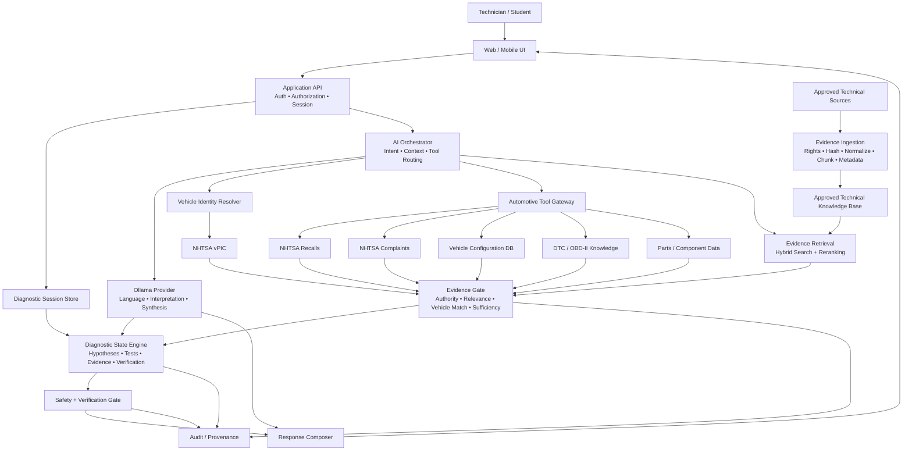
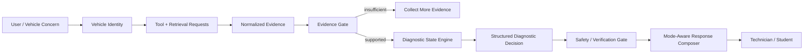

# AI Mechanic Assistant Architecture

**Document ID:** ARCH-AI-002
**Status:** Proposed canonical product architecture
**Runtime owner:** `src/ai/`

## Core rule

The LLM is a language, interpretation, synthesis, explanation, and orchestration component. It is **not** the source of truth, diagnostic database, safety authority, or vehicle-specification authority.

## Production architecture

## Diagnostic flow

## Trust boundaries

1. Raw external API payloads do not flow directly into the model. Tool adapters normalize them.
2. Retrieval and ingestion are separate. Only rights-reviewed, approved sources become retrievable context.
3. Vehicle-specific procedures and specifications require appropriate primary authoritative evidence.
4. A failed evidence gate returns an insufficient-evidence state instead of encouraging inference.
5. The model does not receive raw account identity. Raw VIN is excluded from model context by default.
6. Diagnostic decisions remain structured objects; prose is generated after evidence/safety evaluation.
7. Training and technician response policies are separate.
8. Technician verification is required before a diagnostic recommendation is treated as final.

## NHTSA boundary

Use separate adapters for:
- vPIC / VIN and manufacturer-reported vehicle identity,
- recall data,
- complaint data.

The vPIC API is rate controlled; a cache and, where appropriate, the downloadable VIN-decoding database can improve resilience. The standalone database is not a substitute for other vPIC API data.

## Implementation sequence

1. Vehicle identity resolver
2. Tool gateway and normalized result contracts
3. Evidence and provenance model
4. RAG ingestion/retrieval split
5. Diagnostic session/state engine
6. Ollama orchestration on top of the contracts
7. Safety/verification gate
8. Response/report UI
