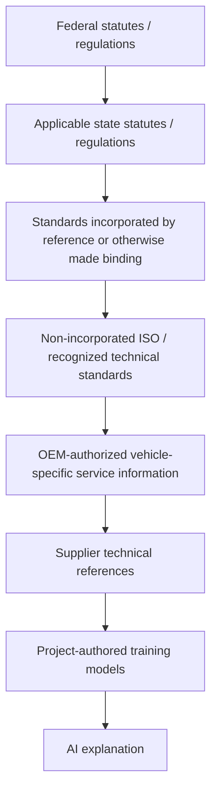

# Compliance Authority Governance

## Governing principle

**Compliance before implementation. Standards before abstractions. Authoritative vehicle data before vehicle-specific claims. Deterministic logic before AI explanation.**

The project distinguishes legal authority from technical authority. A standard is not represented as law merely because it is technically relevant.

## Authority hierarchy

This is an authority ordering for conflict handling and provenance. It does not imply that every lower layer is subordinate on every factual question. In particular, an OEM source may be required to establish actual vehicle implementation even where a regulation or standard governs the required safety outcome.

## Two source-of-truth concepts

### Governing authority

Federal and state legal requirements, together with standards that have actually been incorporated or otherwise made binding.

### Technical source of record

The authoritative source that establishes the actual implementation of a specific vehicle/system.

Examples include licensed or otherwise authorized OEM service information for actual pinouts, connector identifiers, limits, and procedures.

## ISO handling

ISO standards are technical authorities, but they are **not automatically legal requirements**. The registry records whether a standard is incorporated by reference or otherwise binding for the use case.

The project stores identifiers, editions, applicability, and licensed clause locators. Full copyrighted standard text must not be placed into RAG/Ollama context unless a separate license/rights decision explicitly permits that use.

## State-law handling

State requirements are jurisdiction-specific. The initial Kansas record is a consumer/service-compliance overlay and is not treated as a technical electrical design requirement.

Additional state requirements must be added only after applicability and current legal status are verified from an authoritative state source.

## AI boundary

The model may:
- explain a verified rule,
- summarize project-authored structured compliance data,
- identify the authority/provenance attached to a deterministic result.

The model may not:
- create a legal or technical requirement,
- promote a voluntary standard into law,
- override a regulation,
- infer vehicle-specific values or procedures,
- claim compliance where applicability has not been established.
