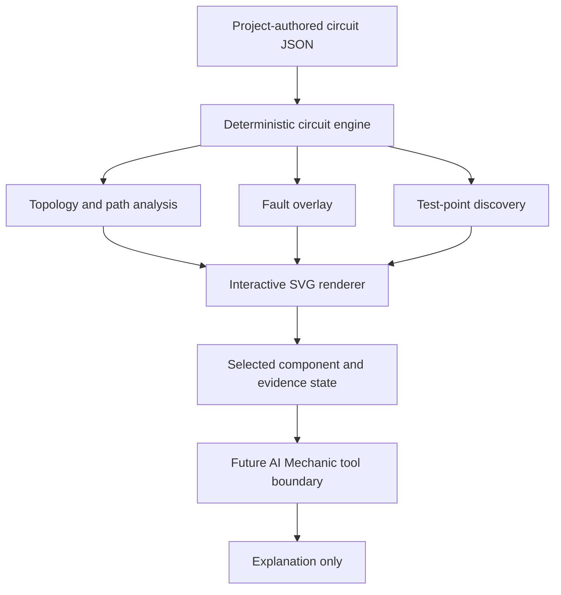

# Interactive Circuit Engine Architecture

## Purpose

Provide a deterministic electrical graph model for project-authored training schematics. The diagram is a rendering of validated circuit data; it is not the electrical source of truth.

## Boundary

- Generic instructional circuits only in the initial implementation.
- No vehicle-specific pinouts, specifications, procedures, or proprietary wiring diagrams.
- Test points may exist, but vehicle-specific values are deliberately absent.
- Faults are overlays and never mutate the canonical circuit definition.
- AI may explain deterministic results later; it must not invent topology or electrical state.

## Flow

## Current implementation

- `data/circuits/generic-charging-system.json`
- `src/circuits/contracts.js`
- `src/circuits/engine.js`
- `dashboard/student/circuit-lab/`
- `scripts/verify-circuit-models.js`

The current static app uses JavaScript with TypeScript-compatible JSDoc contracts. A future React/TypeScript UI can consume the same JSON and deterministic engine contract without redefining circuit truth.

## Next bounded capabilities

1. Additional project-authored circuits.
2. Explicit switch/relay state models.
3. Measurement simulation with clearly synthetic training values.
4. AI Mechanic read-only tools such as path tracing and test-point discovery.
5. Vehicle-specific circuit support only after an appropriate licensed/authorized data source and provenance model are established.
