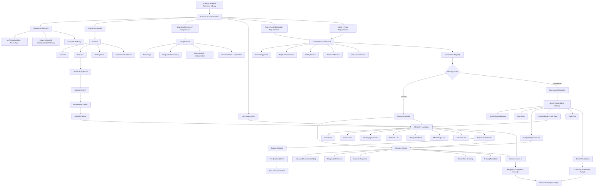
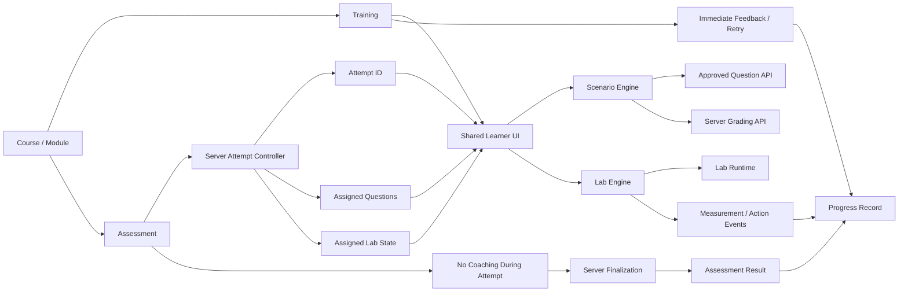

# Shared Attempt and Governance Architecture

## Status

Design baseline for unifying training scenarios, future assessments, and interactive labs without granting any new assessment eligibility. The Cloudflare Worker under `worker/` is the canonical production API runtime. The legacy `api/` tree remains migration-only until route parity and retirement are complete.

## Curriculum-to-delivery architecture



## Runtime architecture



## Runtime boundaries

- Scenario rendering may be shared between training and assessment, but assessment state must be server authoritative.
- Interactive labs keep their specialized simulation engines while sharing learner identity, attempt, governance, audit, and completion contracts.
- Training progress may remain browser-assisted where appropriate; assessment question assignment, lab configuration, scoring, and finalization must not depend on browser-local authority.
- Training approval does not imply scored, high-stakes, institutional, or production-assessment eligibility.
- The Worker routes are canonical for production. Legacy `api/` implementations must not be treated as the production security contract.

## Implementation status

The first server-authoritative binding layer is implemented by `20260928072000_add_assessment_attempt_question_binding.sql` and the Cloudflare Worker routes:

- assessment eligibility is a separate, empty-by-default registry;
- assessment attempts are created atomically with an immutable `attempt_questions` set;
- assessment-mode question delivery reads only the assigned set;
- grading rejects assessment questions that are not assigned to the attempt;
- assessment completion remains unscored in the browser until a server finalization route is implemented.
## Planned server-authoritative assessment contract

A future assessment attempt should bind the learner to an immutable server-selected set of questions and/or lab configuration. The intended data relationship is:

```text
attempts
  id
  user_id
  scenario
  delivery_mode
  status

attempt_questions
  attempt_id
  question_id
  sequence
  assigned_at

attempt_answers
  attempt_id
  question_id
  user_id
  student_answer
  is_correct
  submitted_at
```

Assessment finalization remains blocked until a separate implementation and governance approval establishes server-side completion and sanitized result release.