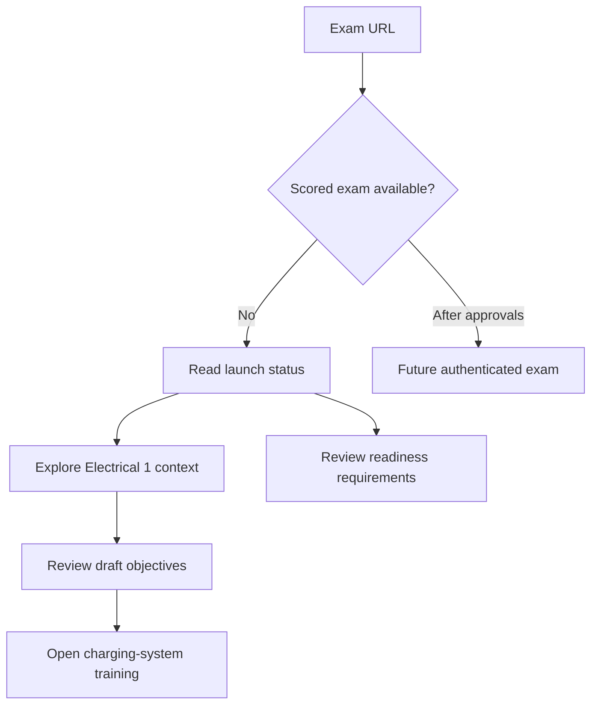

# Exam domain experience (prelaunch)

## User goal and entry
A learner arriving at exam.autolearnpro.com should understand whether a scored exam is available, find the course context, and reach the live training scenario without mistaking draft objectives for approved KBOR wording.

## Journey
1. Status and next action are visible above the fold: exam launch pending; start charging-system training.
2. Explore the verified Automotive Technology program and Electrical 1 common course.
3. Read the AutoLearnPro draft competency and three objectives with a persistent provenance label.
4. Follow the training link into the live scenario. A separate status panel explains what is required before an exam can open.
5. Return through the header or footer. No sign-in, purchase, attempt, score, or credential affordance appears on this domain yet.

## Interaction and states
- Anchor navigation jumps to Overview, Learning path, and Exam status.
- A three-step learning path uses native details disclosure for concise content and keyboard access. Links are actual destinations.
- Exam status is explicit and non-interactive; there is no simulated start button.
- Responsive layout, visible focus, reduced-motion support, semantic landmarks, and sufficient contrast are required.

## Launch boundary
Only the KBOR program classification and listed course title are verified. Competency/objective copy is AutoLearnPro-authored draft. Real exam attempts require approved content, rights and provenance, verified course/question mapping, security, entitlement, and staging checks.
## Flow

The future branch is a design boundary, not a live route or an implemented exam attempt.
