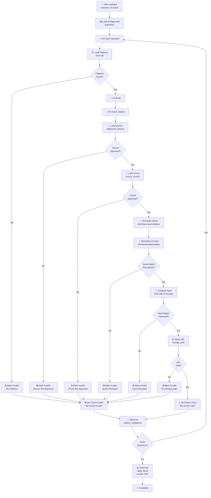

# Citation Validator Architecture

**Responsibility:** Implements deterministic validation of question citations, verifying that quotes are authentic and correctly sourced by computing SHA-256 hashes and comparing against canonical source chunks.

## Overview

The Citation Validator is a deterministic, evidence-based tool that validates every citation in the approved question bank. It proves that each quote is authentic, properly sourced, and correctly attributed by recomputing cryptographic hashes and comparing them against canonical source data.

## Validation Flow



## Verification Steps

### Step 1: Load Citations
```javascript
// Query question_citations for this question
SELECT * FROM question_citations 
WHERE question_provenance_id = $1

// Requirement: Must find at least one citation
if (!citations || citations.length === 0) {
  errors.push("No citations found for this question");
  result = "invalid";
}
```

### Step 2: Verify Source
```javascript
// Load source from approved_sources table
SELECT * FROM approved_sources 
WHERE id = $source_id

// Requirements:
// - Source must exist
// - Source.status must be 'approved'
if (!source || source.status !== 'approved') {
  errors.push("Source not found or not approved");
  urls_verified = false;
}
```

### Step 3: Verify Chunk
```javascript
// Load chunk from source_chunks table
SELECT * FROM source_chunks 
WHERE chunk_id = $chunk_id

// Requirements:
// - Chunk must exist
// - Chunk.status must be 'approved'
if (!chunk || chunk.status !== 'approved') {
  errors.push("Chunk not found or not approved");
  source_hashes_verified = false;
  excerpts_verified = false;
}
```

### Step 4: Normalize & Compare Quote
```javascript
// Normalize both texts:
// 1. Trim leading/trailing whitespace
// 2. Collapse multiple spaces to single space
// 3. Convert to lowercase
function normalize(text) {
  return text.trim()
    .replace(/\s+/g, ' ')
    .toLowerCase();
}

const normalizedQuote = normalize(citation.quote);
const normalizedExcerpt = normalize(chunk.text_excerpt);

if (normalizedQuote !== normalizedExcerpt) {
  errors.push("Quote mismatch after normalization");
  excerpts_verified = false;
}
```

### Step 5: Compute & Verify Hash
```javascript
// Recompute SHA-256 hash of chunk text
const crypto = require('crypto');

function computeHash(text) {
  return crypto
    .createHash('sha256')
    .update(normalize(text))
    .digest('hex');
}

const recomputedHash = computeHash(chunk.text_excerpt);
const canonicalHash = chunk.text_hash;

if (recomputedHash !== canonicalHash) {
  errors.push(
    "Hash mismatch. Canonical: ${canonicalHash} vs Recomputed: ${recomputedHash}"
  );
  source_hashes_verified = false;
}
```

### Step 6: Verify Source Path
```javascript
// Verify source has a canonical URL/storage path
const sourceUrl = source.storage_path;

if (!sourceUrl) {
  errors.push("Source missing storage_path");
  urls_verified = false;
}
```

### Step 7: Aggregate Verification Flags
```javascript
// Set result based on all verification flags
const allVerified = source_hashes_verified 
  && excerpts_verified 
  && urls_verified;

const validationRecord = {
  question_provenance_id: question.id,
  validator_version: "citation-validator-1.0",
  validation_method: "deterministic-source-chunk-verification",
  source_hashes_verified,
  excerpts_verified,
  urls_verified,
  result: allVerified ? 'valid' : 'invalid',
  errors: errors,
  validated_at: new Date()
};
```

### Step 8: Upsert to Database
```javascript
// Upsert with conflict resolution on unique constraint
await supabase
  .from('citation_validations')
  .upsert(validationRecord, {
    onConflict: 'question_provenance_id,validator_version'
  });
```

## Command-Line Interface

### Dry-Run Mode (Read-Only)
Queries and validates without writing to database:
```bash
SUPABASE_URL="https://project.supabase.co" \
SUPABASE_ANON_KEY="sb_publishable_..." \
node scripts/validate-citations.js --scenario no-crank --dry-run
```

**Output:**
```
✓ Found 20 approved questions

✅ no-crank-battery-health-01: VALID
✅ no-crank-battery-health-02: VALID
...

📊 Validation Summary
   Valid: 20/20
   Invalid: 0/20

⏸️ DRY RUN: No records written to database
```

### Production Mode (Write Records)
Queries and writes validation records:
```bash
SUPABASE_URL="https://project.supabase.co" \
SUPABASE_SERVICE_KEY="eyJhbGciOiJIUzI1NiI..." \
node scripts/validate-citations.js --scenario no-crank
```

**Output:**
```
✓ Found 20 approved questions

✅ no-crank-battery-health-01: VALID
✅ no-crank-battery-health-02: VALID
...

💾 Writing validation records...
✓ Upserted: no-crank-battery-health-01
✓ Upserted: no-crank-battery-health-02
...

✅ Citation validation complete
   Records: 20
   Valid: 20
   Invalid: 0
```

## Evidence Trail

Each validation record includes complete evidence for auditing:

```javascript
{
  id: "uuid",
  question_provenance_id: "uuid",
  validator_version: "citation-validator-1.0",
  validation_method: "deterministic-source-chunk-verification",
  source_hashes_verified: true,
  excerpts_verified: true,
  urls_verified: true,
  result: "valid",
  errors: [],
  validated_at: "2026-08-13T00:54:44.415296+00:00",
  
  // Evidence details stored in evidence object:
  evidence: {
    citations_checked: 2,
    citation_ids: ["uuid1", "uuid2"],
    chunk_ids: ["chunk-id-1", "chunk-id-2"],
    calculated_hashes: [
      {
        chunk_id: "chunk-id-1",
        canonical: "3cc616cc711197...",
        recomputed: "3cc616cc711197...",
        match: true
      }
    ],
    excerpts_comparison: [
      {
        citation_id: "uuid1",
        normalized_match: true
      }
    ]
  }
}
```

## Security Properties

### Deterministic
- Same input always produces same output
- No randomness or external dependencies
- Reproducible on any system
- Auditable and verifiable

### Cryptographic
- Uses SHA-256 for hash verification
- Normalized text prevents whitespace issues
- Canonical hashes prevent tampering
- Evidence trail enables auditing

### Evidence-Based
- Never hardcodes verification results
- All flags computed from actual data
- Errors captured for root cause analysis
- Complete trail for compliance

### Fail-Safe
- Missing validation records → questions excluded
- Invalid validation records → questions excluded
- Errors are explicit and detailed
- No silent failures

## Implementation

### Script Location
```
scripts/validate-citations.js (260+ lines)
```

### Dependencies
```json
{
  "@supabase/supabase-js": "^2.x",
  "crypto": "builtin"
}
```

### Usage in CI/CD
```yaml
- name: Validate Question Citations
  run: |
    npm run docs:validate-citations
```

## Concepts

- **Source** - Authoritative published document (PDF, official spec, etc.)
- **Chunk** - Extracted section of source document
- **Hash** - SHA-256 checksum of normalized chunk text
- **Validation** - Verification that citation quote matches canonical chunk
- **Evidence** - Computed values and verification results for auditing
- **Deterministic** - Same results every time for same input

## Related Documentation

- [Question Lifecycle](../data/QUESTION-LIFECYCLE.md) - Approval workflow
- [Scenario Workflow](../dashboard/student/scenario/WORKFLOW.md) - How questions are presented
- [Database Schema](../supabase/DATABASE-ARCHITECTURE.md) - citation_validations table
- [API Architecture](../torquemind-api/ARCHITECTURE.md) - API query logic
- [Test Flows](../tests/playwright/TEST-FLOWS.md) - Validation test coverage
