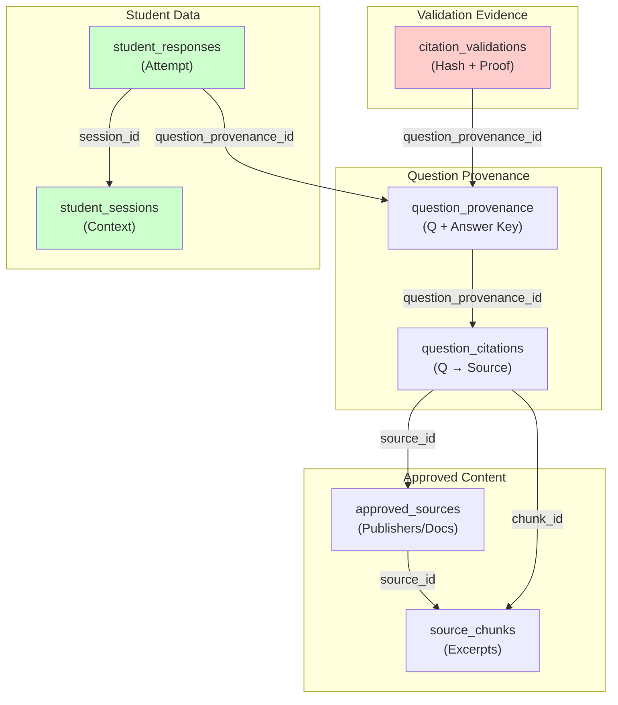

# Database Architecture

**Responsibility:** Designs PostgreSQL schema with RLS (Row Level Security) policies that enforce fail-closed security, ensure approved sources are validated, and prevent unauthorized access to student data.

## Overview

TorqueMind uses Supabase (PostgreSQL 14) as its primary data store with Row-Level Security (RLS) policies that enforce fail-closed authorization. The database schema is designed to separate concerns: question approval, citation validation, and student attempts into distinct tables with explicit trust boundaries.

## Schema Architecture



## Core Tables

### approved_sources
**Responsibility:** Authoritative sources (PDFs, specifications, textbooks) that can be cited in questions.

```sql
CREATE TABLE approved_sources (
  id TEXT PRIMARY KEY,
  title TEXT NOT NULL,
  authors TEXT[] DEFAULT '{}',
  publisher TEXT,
  publication_year INTEGER,
  license JSONB DEFAULT '{}'::JSONB,
  original_filename TEXT,
  storage_path TEXT,
  checksum TEXT,
  checksum_algorithm TEXT DEFAULT 'sha256',
  language TEXT DEFAULT 'en',
  version INTEGER DEFAULT 1,
  status TEXT NOT NULL CHECK (status IN ('draft', 'approved', 'superseded')),
  superseded_by TEXT,
  uploaded_by UUID REFERENCES auth.users,
  uploaded_at TIMESTAMPTZ DEFAULT NOW(),
  license_reviewed_by UUID REFERENCES auth.users,
  license_reviewed_at TIMESTAMPTZ,
  notes TEXT
);

CREATE INDEX idx_approved_sources_status ON approved_sources(status);
```

**Key Fields:**
- `id`: Unique identifier (e.g., "gm-no-crank-pi-2014")
- `storage_path`: Canonical URL for the source document
- `status`: Must be 'approved' for citations to be valid
- `checksum`: SHA-256 of source document for integrity
- `license`: JSON containing license terms and restrictions

### source_chunks
**Responsibility:** Extracted passages from approved sources that can be quoted in questions.

```sql
CREATE TABLE source_chunks (
  chunk_id TEXT PRIMARY KEY,
  source_id TEXT NOT NULL REFERENCES approved_sources(id) ON DELETE CASCADE,
  source_version INTEGER NOT NULL,
  title TEXT,
  section TEXT,
  page_start INTEGER,
  page_end INTEGER,
  locator TEXT,
  text_excerpt TEXT NOT NULL,
  token_count INTEGER,
  overlap_before_tokens INTEGER DEFAULT 0,
  overlap_after_tokens INTEGER DEFAULT 0,
  text_hash TEXT NOT NULL,
  language TEXT DEFAULT 'en',
  status TEXT NOT NULL CHECK (status IN ('draft', 'approved')),
  approved BOOLEAN DEFAULT FALSE,
  created_at TIMESTAMPTZ DEFAULT NOW(),
  approved_by UUID REFERENCES auth.users,
  approved_at TIMESTAMPTZ
);

CREATE INDEX idx_source_chunks_source_id ON source_chunks(source_id);
CREATE INDEX idx_source_chunks_status ON source_chunks(status);
CREATE INDEX idx_source_chunks_text_hash ON source_chunks(text_hash);
```

**Key Fields:**
- `chunk_id`: Unique identifier (e.g., "gm-no-crank-battery-health")
- `text_excerpt`: The exact text that will be quoted
- `text_hash`: SHA-256 of normalized text for verification
- `status`: Must be 'approved' for citations to be valid
- `locator`: Where to find this in source (page/section)

### question_provenance
**Responsibility:** Diagnostic questions with answer keys, metadata, and approval status.

```sql
CREATE TABLE question_provenance (
  id UUID PRIMARY KEY DEFAULT gen_random_uuid(),
  question_id TEXT NOT NULL UNIQUE,
  status TEXT NOT NULL CHECK (status IN ('draft', 'validated', 'approved')),
  question_text TEXT NOT NULL,
  answer_options JSONB DEFAULT '[]'::JSONB,
  answer_key TEXT NOT NULL,
  difficulty_rating INTEGER CHECK (difficulty_rating >= 1 AND difficulty_rating <= 5),
  subject_area TEXT,
  learning_objectives TEXT[],
  created_by UUID NOT NULL REFERENCES auth.users,
  created_at TIMESTAMPTZ DEFAULT NOW(),
  approved_by UUID REFERENCES auth.users,
  approved_at TIMESTAMPTZ,
  version INTEGER DEFAULT 1,
  notes TEXT
);

CREATE INDEX idx_question_provenance_status ON question_provenance(status);
CREATE INDEX idx_question_provenance_question_id ON question_provenance(question_id);
```

**Key Fields:**
- `question_id`: Prefixed identifier (e.g., "no-crank-battery-health-01")
- `status`: Progression through approval workflow
- `answer_key`: Hidden until student submits
- `created_by`/`approved_by`: Audit trail of who approved

### question_citations
**Responsibility:** Links questions to source evidence through quotes.

```sql
CREATE TABLE question_citations (
  id UUID PRIMARY KEY DEFAULT gen_random_uuid(),
  question_provenance_id UUID NOT NULL REFERENCES question_provenance(id) ON DELETE CASCADE,
  source_id TEXT NOT NULL REFERENCES approved_sources(id),
  chunk_id TEXT NOT NULL REFERENCES source_chunks(chunk_id),
  locator TEXT,
  quote TEXT NOT NULL,
  role TEXT NOT NULL CHECK (role IN ('supports-answer', 'provides-context', 'explains-reasoning')),
  created_at TIMESTAMPTZ DEFAULT NOW(),
  UNIQUE(question_provenance_id, source_id, chunk_id, role)
);

CREATE INDEX idx_question_citations_question_id ON question_citations(question_provenance_id);
CREATE INDEX idx_question_citations_source_id ON question_citations(source_id);
CREATE INDEX idx_question_citations_chunk_id ON question_citations(chunk_id);
```

**Key Fields:**
- `quote`: Exact excerpt from chunk
- `role`: Type of citation (answer support, context, reasoning)
- UNIQUE constraint ensures no duplicate citations per question

### citation_validations
**Responsibility:** Evidence that citations are authentic and properly sourced (RLS-protected).

```sql
CREATE TABLE citation_validations (
  id UUID PRIMARY KEY DEFAULT gen_random_uuid(),
  question_provenance_id UUID NOT NULL REFERENCES question_provenance(id) ON DELETE CASCADE,
  validator_version TEXT NOT NULL,
  validation_method TEXT DEFAULT 'deterministic-source-chunk-verification',
  source_hashes_verified BOOLEAN NOT NULL DEFAULT FALSE,
  excerpts_verified BOOLEAN NOT NULL DEFAULT FALSE,
  urls_verified BOOLEAN NOT NULL DEFAULT FALSE,
  result TEXT NOT NULL CHECK (result IN ('valid', 'invalid')),
  errors JSONB DEFAULT '[]'::JSONB,
  validated_at TIMESTAMPTZ DEFAULT NOW(),
  UNIQUE(question_provenance_id, validator_version)
);

CREATE INDEX idx_citation_validations_question_id ON citation_validations(question_provenance_id);
CREATE INDEX idx_citation_validations_result ON citation_validations(result);

-- RLS POLICY: Fail-Closed Security
-- Only return valid citations with all verification flags true
CREATE POLICY citation_validations_select_policy
ON citation_validations
FOR SELECT
TO authenticated
USING (
  result = 'valid'
  AND source_hashes_verified = true
  AND excerpts_verified = true
  AND urls_verified = true
);
```

**Key Fields:**
- `result`: 'valid' or 'invalid'
- Verification flags: `source_hashes_verified`, `excerpts_verified`, `urls_verified`
- `errors`: JSON array of validation failures
- **RLS Policy:** Only visible when result='valid' AND all flags=true

### student_responses
**Responsibility:** Student answers and grading results (per student).

```sql
CREATE TABLE student_responses (
  id UUID PRIMARY KEY DEFAULT gen_random_uuid(),
  session_id UUID NOT NULL REFERENCES student_sessions(id) ON DELETE CASCADE,
  question_provenance_id UUID NOT NULL REFERENCES question_provenance(id),
  student_id UUID NOT NULL REFERENCES auth.users,
  student_response TEXT NOT NULL,
  is_correct BOOLEAN,
  score INTEGER DEFAULT 0,
  max_score INTEGER DEFAULT 1,
  submitted_at TIMESTAMPTZ DEFAULT NOW(),
  graded_at TIMESTAMPTZ,
  time_spent_seconds INTEGER
);

CREATE INDEX idx_student_responses_session_id ON student_responses(session_id);
CREATE INDEX idx_student_responses_student_id ON student_responses(student_id);

-- RLS POLICY: Students see only their own responses
CREATE POLICY student_responses_student_policy
ON student_responses
FOR SELECT
USING (
  auth.uid() = student_id
  OR current_setting('role') = 'instructor'
);
```

### student_sessions
**Responsibility:** Attempt context including scenario, start/end time, and overall score.

```sql
CREATE TABLE student_sessions (
  id UUID PRIMARY KEY DEFAULT gen_random_uuid(),
  student_id UUID NOT NULL REFERENCES auth.users,
  scenario_id TEXT NOT NULL,
  session_type TEXT CHECK (session_type IN ('training', 'assessment')),
  started_at TIMESTAMPTZ DEFAULT NOW(),
  completed_at TIMESTAMPTZ,
  total_score INTEGER DEFAULT 0,
  max_score INTEGER DEFAULT 20,
  status TEXT CHECK (status IN ('in-progress', 'completed', 'abandoned'))
);

CREATE INDEX idx_student_sessions_student_id ON student_sessions(student_id);
CREATE INDEX idx_student_sessions_scenario_id ON student_sessions(scenario_id);

-- RLS POLICY: Students see only their own sessions
CREATE POLICY student_sessions_student_policy
ON student_sessions
FOR SELECT
USING (
  auth.uid() = student_id
  OR current_setting('role') = 'instructor'
);
```

## Security Model

### Row-Level Security (RLS)

**citation_validations Table (Fail-Closed):**
```sql
-- Anonymous/Authenticated users can only see VALID records
CREATE POLICY "citation_validations_select_public"
ON citation_validations
FOR SELECT
TO authenticated
USING (
  result = 'valid'
  AND source_hashes_verified = true
  AND excerpts_verified = true
  AND urls_verified = true
);
```

**Behavior:**
- When API queries `citation_validations` for a question, RLS filters by the policy
- If validation record is missing → 0 rows returned
- If validation record exists but result='invalid' → 0 rows returned
- If ALL verification flags aren't true → 0 rows returned
- Only when result='valid' AND all flags=true → record is visible

**Result:** Questions without validation evidence are automatically excluded.

### Student Data Privacy
```sql
-- Students can only see their own responses
CREATE POLICY "student_responses_private"
ON student_responses
FOR SELECT
USING (auth.uid() = student_id);

-- Instructors can see all student responses
CREATE POLICY "student_responses_instructor"
ON student_responses
FOR SELECT
USING (current_setting('role') = 'instructor');
```

## Data Relationships

```
approved_sources (Publisher docs)
       ↓ source_id
source_chunks (Extracted passages)
       ↓ chunk_id
question_citations ←→ question_provenance (Q + Answer Key)
       ↓ question_provenance_id
citation_validations (Hash verification evidence)
       ↓ RLS Policy: only valid=true visible
question_citations (Becomes visible to API)
       ↓
student_responses (Grading results)
```

## Key Properties

### Data Integrity
- Foreign key constraints prevent orphaned records
- CASCADE deletes maintain referential integrity
- UNIQUE constraints prevent duplicates
- CHECK constraints enforce valid values

### Audit Trail
- `created_by`, `approved_by` track approvers
- `created_at`, `approved_at`, `validated_at` track timing
- `status` shows progression through workflow
- `errors` array captures validation details

### Performance
- Indexes on frequently queried columns (status, question_id, etc.)
- Hash index for citation_validations.result filter
- Composite indexes for common joins

### Security
- RLS policies enforce least privilege access
- Student data isolated by student_id
- Citation validation gated by result='valid'
- Answer keys not visible in question_provenance SELECT

## Migrations

All schema changes are version-controlled SQL migrations in:
```
supabase/migrations/
├── 001-initial-schema.sql
├── 002-add-rls-policies.sql
├── ...
└── 20260813-create-citation-validations.sql
```

## Related Documentation

- [Citation Validator](../scripts/CITATION-VALIDATOR.md) - Generates validation records
- [Question Lifecycle](../data/QUESTION-LIFECYCLE.md) - Approval workflow
- [API Architecture](../torquemind-api/ARCHITECTURE.md) - API query logic
- [Scenario Workflow](../dashboard/student/scenario/WORKFLOW.md) - Data flow
- [Test Flows](../tests/playwright/TEST-FLOWS.md) - Test coverage
