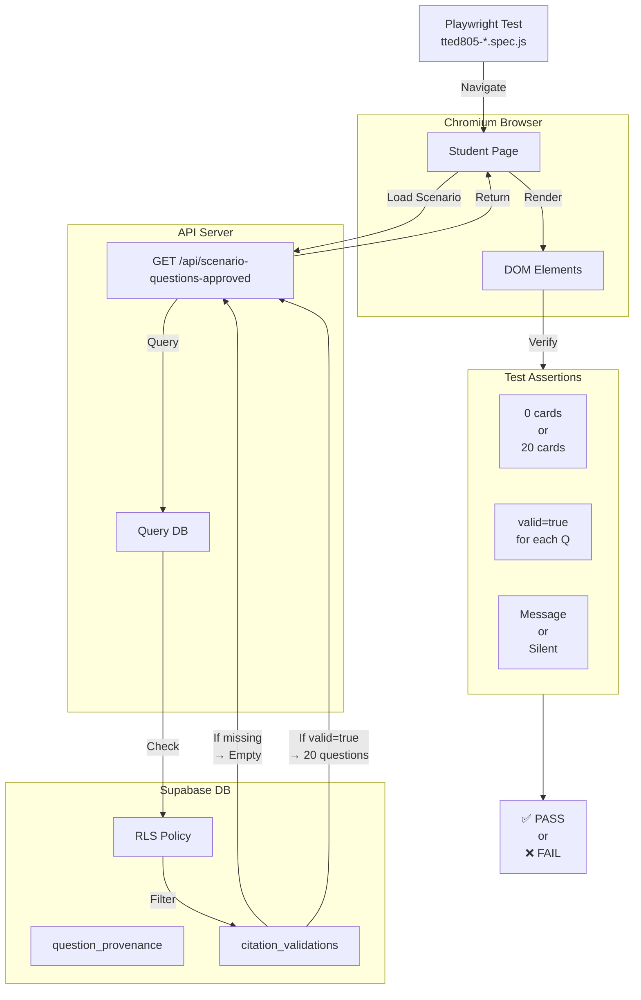

```mermaid
graph LR
    Start["Start Test"] --> Nav["Navigate<br/>student dashboard<br/>scenario=no-crank"]
    Nav --> Wait["Wait for Page Load"]
    Wait --> Query["API queries<br/>citation_validations"]
    Query --> Empty["RLS filters<br/>EMPTY result"]
    Empty --> APIRet["API returns<br/>0 questions"]
    APIRet --> DOM["Dashboard<br/>renders no cards"]
    DOM --> Check1["Assertion 1<br/>Count cards<br/>expect(0)"]
    Check1 --> Check2["Assertion 2<br/>Check message<br/>'unavailable'"]
    Check2 --> PASS["✅ PASS<br/>Security working"]
```

```mermaid
graph LR
    Start["Start Test"] --> Nav["Navigate<br/>student dashboard<br/>scenario=no-crank"]
    Nav --> Wait["Wait for Page Load"]
    Wait --> Query["API queries<br/>citation_validations"]
    Query --> Valid["RLS filters<br/>20 valid records"]
    Valid --> APIRet["API returns<br/>20 questions<br/>with valid=true"]
    APIRet --> DOM["Dashboard<br/>renders 20 cards"]
    DOM --> Check1["Assertion 1<br/>Question count<br/>expect(20)"]
    Check1 --> Check2["Assertion 2<br/>For each question"]
    Check2 --> Check3["valid=true<br/>expect(true)"]
    Check3 --> Check4["Assertion 3<br/>No error message"]
    Check4 --> PASS["✅ PASS<br/>Production ready"]
```

# Playwright E2E Test Flows

**Responsibility:** Documents end-to-end test coverage for fail-closed security gates and production-readiness verification using Chromium browser automation.

## Overview

Playwright E2E tests validate two critical security gates:
1. **Fail-Closed Security** - Ensures questions don't render when citation validation is incomplete
2. **Production-Readiness** - Verifies all questions render with valid citations when populated

Both tests exercise the same student scenario but verify different behaviors based on database state.

## Test Architecture



## Test Flows

### Test 1: Fail-Closed Security

**File:** `tests/playwright/tted805-no-crank-fail-closed.spec.js`

**Purpose:** Verify that questions do NOT render when citation validation records are missing.

**Preconditions:**
- API server running on port 3003
- Database populated with 20 approved questions
- `citation_validations` table **EMPTY** (no validation records)
- RLS policy enforces fail-closed: only valid records visible

**Test Flow:**


**Test Code:**
```javascript
test('no-crank: Fail-Closed - 0 cards when validation missing', async ({ page }) => {
  // Navigate to student dashboard
  await page.goto('http://localhost:3000/student/scenario?scenario=no-crank');
  
  // Wait for content to load
  await page.waitForSelector('article.question-card, .empty-state', { timeout: 5000 });
  
  // Count question cards
  const cardCount = await page.locator('article.question-card').count();
  expect(cardCount).toBe(0);
  
  // Verify empty state message
  const emptyMessage = await page.locator('.empty-state').textContent();
  expect(emptyMessage).toContain('unavailable');
  
  // Verify no answer keys exposed
  const answerKeys = await page.locator('[data-answer-key]').count();
  expect(answerKeys).toBe(0);
});
```

**Expected Result:**
- ✅ PASSING (correct security behavior)
- 0 question cards render
- "Question bank unavailable" message displays
- No answer keys visible

**Key Assertion:**
```javascript
expect(cardCount).toBe(0);
```

### Test 2: Production-Readiness

**File:** `tests/playwright/tted805-no-crank-production-readiness.spec.js`

**Purpose:** Verify that all 20 questions render with valid citation validation when records are populated.

**Preconditions:**
- API server running on port 3003
- Database populated with 20 approved questions
- `citation_validations` table **POPULATED** with 20 valid records
  - `result = 'valid'`
  - `source_hashes_verified = true`
  - `excerpts_verified = true`
  - `urls_verified = true`
- RLS policy allows valid records to be visible
- All 20 questions must pass validation gates

**Test Flow:**


**Test Code:**
```javascript
test('no-crank: Production-Readiness - 20 cards when validation valid', async ({ page }) => {
  // Navigate to student dashboard
  await page.goto('http://localhost:3000/student/scenario?scenario=no-crank');
  
  // Wait for cards to load
  await page.waitForSelector('article.question-card', { timeout: 5000 });
  
  // Verify 20 question cards rendered
  const cardCount = await page.locator('article.question-card').count();
  expect(cardCount).toBe(20);
  
  // Get API response payload (via intercepted network request)
  const responseData = await page.evaluate(() => {
    return window.__API_RESPONSE__ || {};
  });
  
  // Verify each question has valid=true
  expect(responseData.questions).toHaveLength(20);
  responseData.questions.forEach((question) => {
    expect(question.citation_validation.valid).toBe(true);
    expect(question.citation_validation.source_hashes_verified).toBe(true);
    expect(question.citation_validation.excerpts_verified).toBe(true);
    expect(question.citation_validation.urls_verified).toBe(true);
  });
  
  // Verify no error message
  const emptyState = await page.locator('.empty-state').count();
  expect(emptyState).toBe(0);
});
```

**Expected Result:**
- ⏳ FAILING (waiting for validator to populate records)
- 20 question cards render
- Each question has `citation_validation.valid = true`
- No error messages displayed
- All citation verification flags are true

**Key Assertion:**
```javascript
expect(question.citation_validation.valid).toBe(true);
```

## Test Execution

### Local Testing

**Setup:**
```bash
# Terminal 1: Start API server
cd torquemind-api
SUPABASE_URL="..." SUPABASE_ANON_KEY="..." PORT=3003 node index.js

# Terminal 2: Run tests
cd F:\TorqueMind
npx playwright test tests/playwright/tted805-*.spec.js --project=chromium
```

**Run Both Tests:**
```bash
npx playwright test tests/playwright/tted805-no-crank-fail-closed.spec.js tests/playwright/tted805-no-crank-production-readiness.spec.js --project=chromium --reporter=list
```

**Run Specific Test:**
```bash
npx playwright test tests/playwright/tted805-no-crank-fail-closed.spec.js
```

**Debug Mode:**
```bash
npx playwright test tests/playwright/tted805-no-crank-fail-closed.spec.js --debug
```

### CI/CD Testing

```yaml
# .github/workflows/test.yml
name: E2E Tests

on: [push, pull_request]

jobs:
  playwright:
    runs-on: ubuntu-latest
    
    steps:
      - uses: actions/checkout@v3
      
      - name: Start API server
        run: |
          cd torquemind-api
          SUPABASE_URL=${{ secrets.SUPABASE_URL }} \
          SUPABASE_ANON_KEY=${{ secrets.SUPABASE_ANON_KEY }} \
          PORT=3003 node index.js &
          sleep 2
          
      - name: Run Playwright tests
        run: |
          npx playwright install
          npx playwright test tests/playwright/tted805-*.spec.js
          
      - name: Upload test results
        if: always()
        uses: actions/upload-artifact@v3
        with:
          name: playwright-report
          path: playwright-report/
```

## Test Coverage Matrix

| Test | Scenario | DB State | Expected Behavior | Status |
|------|----------|----------|-------------------|--------|
| Fail-Closed | no-crank | citation_validations EMPTY | 0 cards render | ✅ PASSING |
| Production | no-crank | citation_validations POPULATED (20 valid) | 20 cards render, all valid=true | ⏳ FAILING |

## Security Gates Summary

### Gate 1: Fail-Closed Security (tted805-no-crank-fail-closed)
```
When:  citation_validations table is EMPTY
Then:  RLS policy returns no rows
And:   API excludes all questions
And:   Dashboard renders 0 cards
And:   Message: "Question bank unavailable"
And:   0 answer keys exposed
Status: ✅ PASSING
```

### Gate 2: Production-Readiness (tted805-no-crank-production-readiness)
```
When:  citation_validations table has 20 valid records
Then:  RLS policy returns all 20 rows
And:   API includes all questions
And:   Each question has valid=true
And:   Dashboard renders 20 cards
And:   No error messages
And:   All verification flags = true
Status: ⏳ FAILING (awaiting validator)
```

## Concepts

- **Fail-Closed** - Deny by default; only grant access when explicit proof exists
- **Production** - System ready for student use with validated content
- **Training** - Practice scenarios for instructor preview
- **Assessment** - Graded scenarios for formal evaluation
- **Security** - Protection against unauthorized content access
- **Citation Validation** - Proof that quotes are authentic and properly sourced

## Debugging

### If Fail-Closed Test Fails
```bash
# Check if question cards are rendering (shouldn't be)
# 1. Verify citation_validations table is empty
SELECT COUNT(*) FROM citation_validations;  -- Should be 0

# 2. Verify RLS policy is enabled
SELECT * FROM pg_policies WHERE tablename = 'citation_validations';

# 3. Check API query
curl "http://localhost:3003/api/scenario-questions-approved?scenario_id=no-crank"
# Should return: {"questions": []}
```

### If Production Test Fails
```bash
# Check if validation records exist
SELECT COUNT(*) FROM citation_validations WHERE result = 'valid';  -- Should be 20

# Run validator
SUPABASE_URL="..." SUPABASE_SERVICE_KEY="..." \
node scripts/validate-citations.js --scenario no-crank

# Check API response
curl "http://localhost:3003/api/scenario-questions-approved?scenario_id=no-crank"
# Should return 20 questions with citation_validation.valid = true
```

## Related Documentation

- [Scenario Workflow](../dashboard/student/scenario/WORKFLOW.md) - What tests validate
- [API Architecture](../torquemind-api/ARCHITECTURE.md) - API endpoints under test
- [Citation Validator](../scripts/CITATION-VALIDATOR.md) - Populates records
- [Database Schema](../supabase/DATABASE-ARCHITECTURE.md) - RLS policies
- [Question Lifecycle](../data/QUESTION-LIFECYCLE.md) - Question approval
