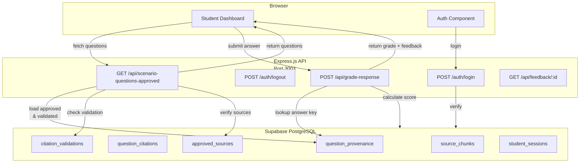

# API Architecture

**Responsibility:** Serves approved questions to the dashboard, validates citations, executes grading logic, and manages authentication tokens.

## Overview

The TorqueMind API is an Express.js server that bridges the Browser/Dashboard layer with the Supabase database. It enforces authentication, loads approved questions with validated citations, and provides grading endpoints for real-time feedback.

## Architecture



## Core Endpoints

### Authentication Endpoints

#### POST /auth/login
- **Purpose:** Authenticate student and issue JWT token
- **Request:**
  ```json
  {
    "email": "student@example.com",
    "password": "..."
  }
  ```
- **Response:**
  ```json
  {
    "success": true,
    "token": "eyJhbGciOiJIUzI1NiIs...",
    "user_id": "uuid",
    "email": "student@example.com"
  }
  ```
- **Security:** Rate-limited, password hashed, token expires in 1 hour

#### POST /auth/logout
- **Purpose:** Invalidate student JWT token
- **Requires:** Bearer token
- **Response:** Success confirmation

### Question Endpoints

#### GET /api/scenario-questions-approved?scenario_id=no-crank
- **Purpose:** Load approved & validated questions for a scenario
- **Requires:** Bearer token, valid scenario_id
- **Query Parameters:**
  - `scenario_id` (required): Scenario identifier (e.g., `no-crank`)
  - `limit` (optional): Maximum questions to return
  - `offset` (optional): Pagination offset
- **Response:**
  ```json
  {
    "success": true,
    "scenario_id": "no-crank",
    "questions": [
      {
        "question_id": "no-crank-battery-health-01",
        "question_text": "What is...",
        "answer_options": ["A", "B", "C", "D"],
        "citations": [
          {
            "source_id": "gm-no-crank-pi-2014",
            "chunk_id": "gm-no-crank-battery-health",
            "quote": "...",
            "role": "supports-answer"
          }
        ],
        "citation_validation": {
          "valid": true,
          "source_hashes_verified": true,
          "excerpts_verified": true,
          "urls_verified": true
        }
      }
    ],
    "total": 20
  }
  ```
- **Fail-Closed Behavior:** Returns empty questions array if ANY question lacks citation validation
- **Logic:**
  1. Query `question_provenance` where status='approved' AND question_id LIKE 'scenario-%'
  2. For each question, load `question_citations`
  3. Check `citation_validations` RLS policy (only valid records visible)
  4. If validation record exists with valid=true for all checks, include question
  5. If validation record missing or invalid, exclude question
  6. Return only questions that passed all gates

### Grading Endpoints

#### POST /api/grade-response
- **Purpose:** Grade student response and generate feedback
- **Requires:** Bearer token
- **Request:**
  ```json
  {
    "question_id": "no-crank-battery-health-01",
    "student_response": "A",
    "session_id": "uuid"
  }
  ```
- **Response:**
  ```json
  {
    "success": true,
    "correct": true,
    "score": 1,
    "max_score": 1,
    "feedback": "Correct! The battery State of Health...",
    "explanation": "...",
    "citations": [...]
  }
  ```
- **Logic:**
  1. Verify question exists and is approved
  2. Load answer key from `question_provenance`
  3. Compare student_response to answer key
  4. Calculate score (1 point if correct, 0 if incorrect)
  5. Load citation evidence for feedback
  6. Store response in `student_responses` table
  7. Return grading result with educational feedback

#### GET /api/feedback/:question_id
- **Purpose:** Retrieve detailed feedback for a question
- **Requires:** Bearer token
- **Response:**
  ```json
  {
    "question_id": "no-crank-battery-health-01",
    "correct_answer": "A",
    "explanation": "...",
    "learning_resources": [...]
  }
  ```

## Database Integration

### Question Loading Flow
1. **Query approved questions:**
   ```sql
   SELECT * FROM question_provenance 
   WHERE status = 'approved' 
   AND question_id LIKE 'no-crank-%'
   ```

2. **Load citations for each question:**
   ```sql
   SELECT * FROM question_citations 
   WHERE question_provenance_id = $1
   ```

3. **Check citation validation (fail-closed):**
   ```sql
   SELECT * FROM citation_validations 
   WHERE question_provenance_id = $1 
   AND result = 'valid'
   AND source_hashes_verified = true
   AND excerpts_verified = true
   AND urls_verified = true
   ```

4. **Load source/chunk details:**
   ```sql
   SELECT * FROM approved_sources WHERE id = $1
   SELECT * FROM source_chunks WHERE chunk_id = $1
   ```

### RLS Policies (Row Level Security)
The database enforces fail-closed security at the table level:

**citation_validations RLS Policy:**
```sql
CREATE POLICY "Only return valid citations"
ON citation_validations
FOR SELECT
TO authenticated
USING (
  result = 'valid' 
  AND source_hashes_verified = true
  AND excerpts_verified = true
  AND urls_verified = true
);
```

When a question lacks validation evidence, the RLS policy prevents the record from being visible to API queries, forcing the API to treat it as missing.

## Security Model

### Authentication
- **Method:** JWT token via Bearer header
- **Issuer:** TorqueMind Auth Service
- **Expiration:** 1 hour
- **Refresh:** Refresh tokens stored in secure HttpOnly cookies

### Authorization
- **Student Access:** Can only view questions and grades for their own sessions
- **Instructor Access:** Can view all student responses and gradebook
- **Admin Access:** Can manage scenarios and approved sources

### Citation Validation
- **Fail-Closed:** When citation validation records are missing, questions are excluded
- **Hash Verification:** Validates quote text against canonical chunk hashes (SHA-256)
- **Source Verification:** Confirms all citations reference approved sources
- **Evidence Trail:** Each validation record includes computed evidence for audit

## Related Documentation

- [Student Dashboard](../dashboard/student/ARCHITECTURE.md) - Frontend layer
- [Scenario Workflow](../dashboard/student/scenario/WORKFLOW.md) - Diagnostic workflow
- [Question Lifecycle](../data/QUESTION-LIFECYCLE.md) - Question approval process
- [Citation Validator](../scripts/CITATION-VALIDATOR.md) - Validation evidence generation
- [Database Schema](../supabase/DATABASE-ARCHITECTURE.md) - Supabase structure
- [Test Flows](../tests/playwright/TEST-FLOWS.md) - E2E test coverage
